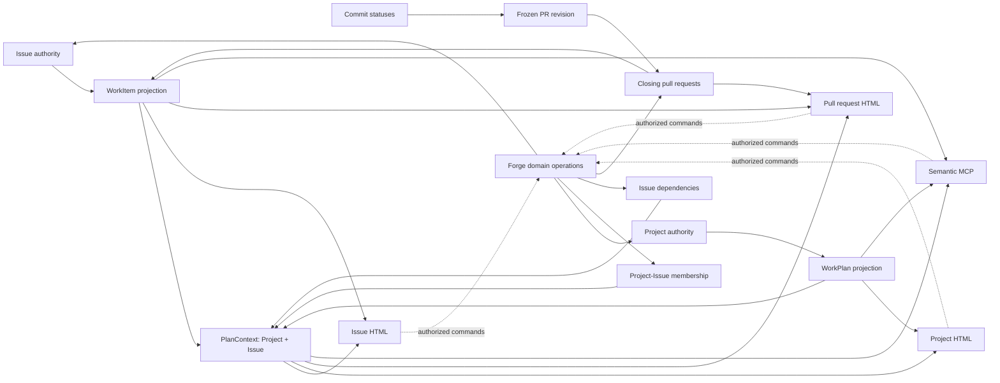
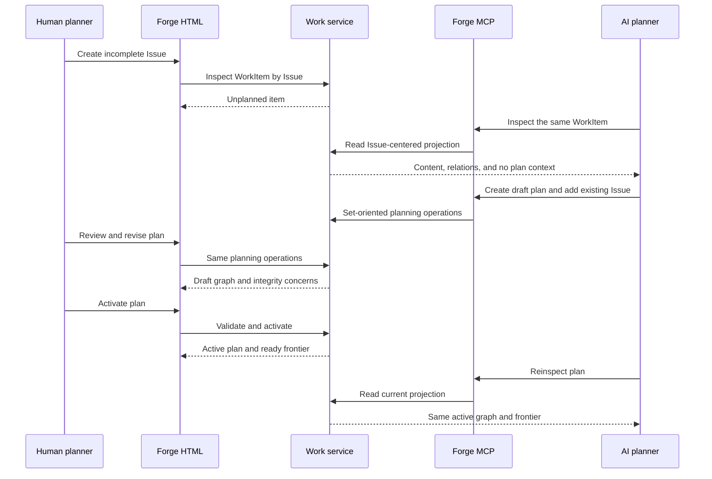
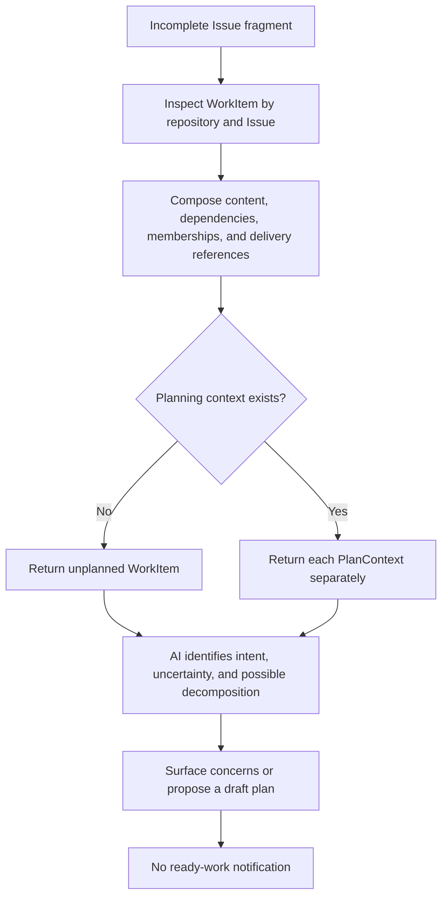
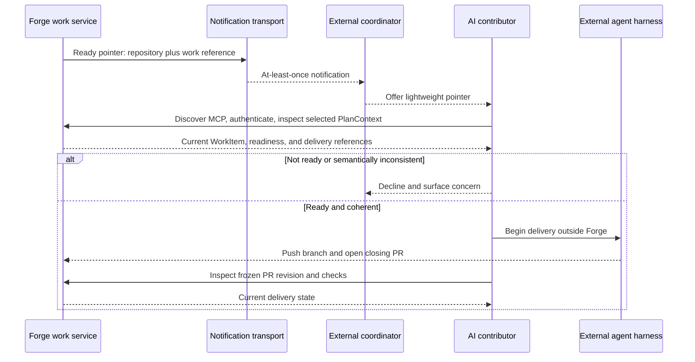
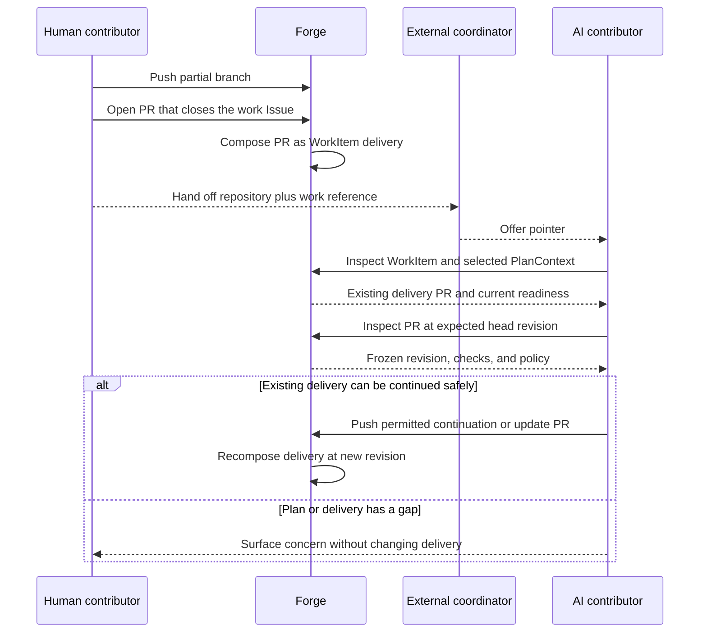
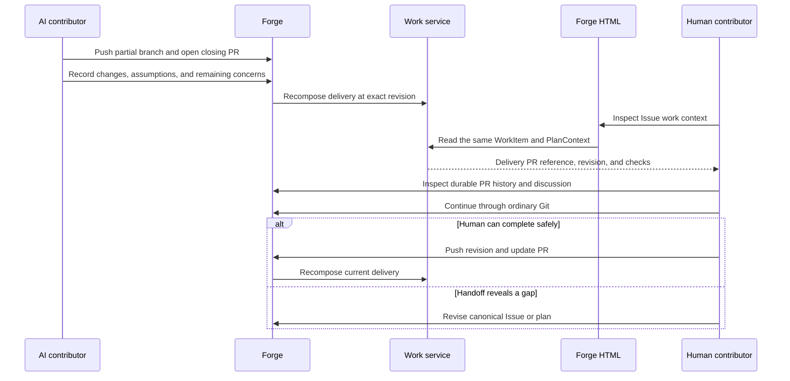
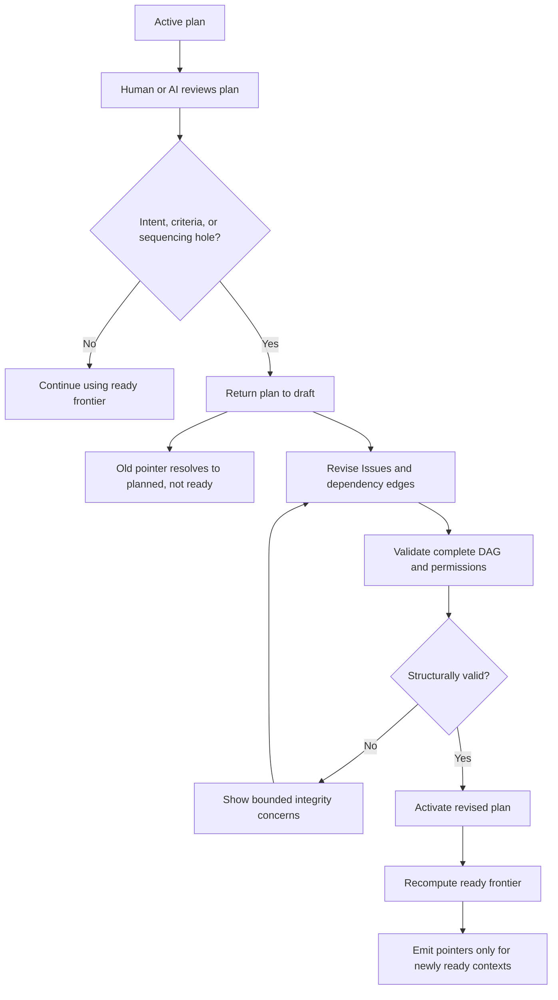
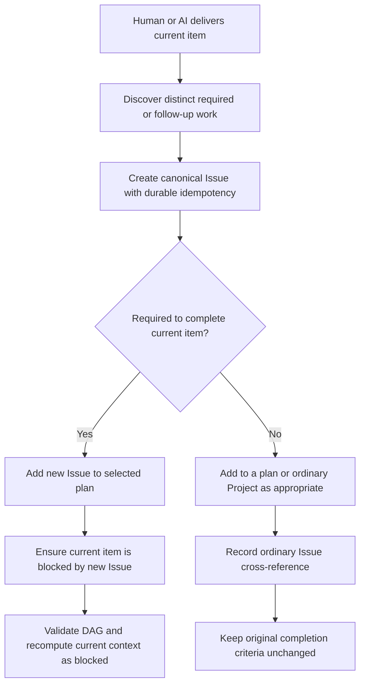
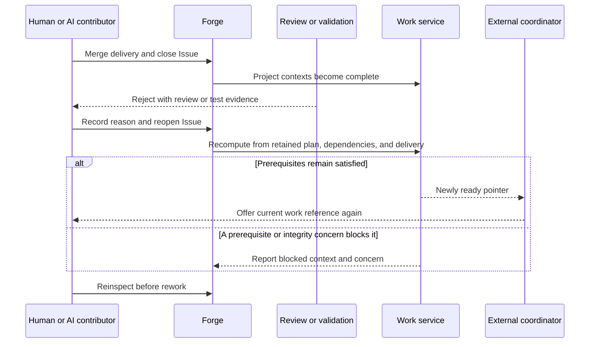
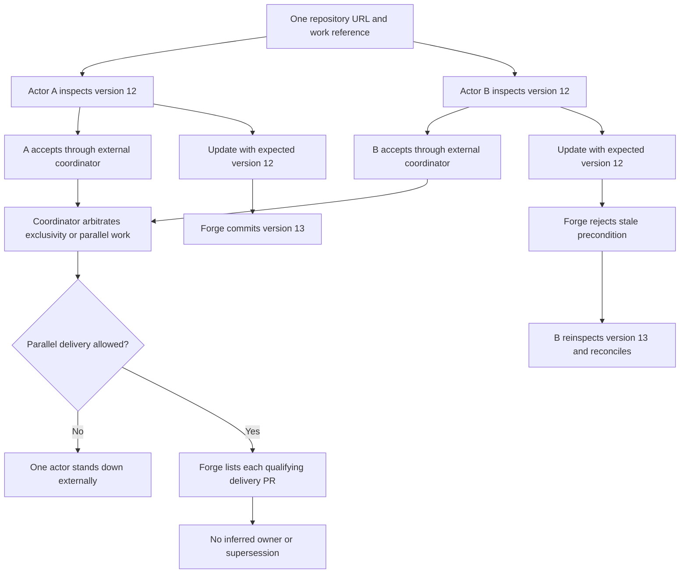

# ADR 0003: Compose planned work from existing Forge authorities

- Status: Proposed
- Date: 2026-08-28
- Decision owner: Forge maintainer
- Depends on: [ADR 0001](0001-agent-native-forge-domain.md),
  [ADR 0002](0002-native-semantic-mcp.md)

## Context

Forge needs a native place for a human and an agent to plan software work before
an external coordinator offers that work to an execution harness. Today the
plan commonly lives in a conversation while the repository, issues, pull
requests, reviews, and checks live in the forge. The conversation then becomes
a shadow authority for sequencing, completion criteria, and what may proceed in
parallel.

The inherited Gitea substrate already persists most of the relevant facts:

- repository and organization [`Project`](../../../models/project/project.go)
  records provide titled containers and human board views;
- [`ProjectIssue`](../../../models/project/issue.go) cards relate Projects to
  Issues, and pull requests are specialized Issues in the same model;
- [`Issue`](../../../models/issues/issue.go) records provide repository-scoped
  identifiers, Markdown descriptions, content versions, history, open or closed
  state, labels, milestones, and permissions;
- [`IssueDependency`](../../../models/issues/dependency.go) records persist
  directional `blocked by` relationships;
- [pull request cross-references](../../../models/issues/issue_xref.go) persist
  closing and reopening relationships to Issues;
- pull requests identify their base, internal head, live source, and merged
  revisions; and
- [`CommitStatus`](../../../models/git/commit_status.go) provides the
  revision-bound common representation for Forge Actions and external CI
  results.

These objects are useful independently, but no domain operation currently
answers whether a Project is a valid work plan, which work is ready, or which
pull requests and checks currently deliver a particular work item. External
clients must reconstruct those answers from transport-shaped resources.

Useful work also begins before formal planning. A human may capture only a
title and a few uncertain sentences in an Issue, or add that Issue to an
ordinary Project. Requiring plan membership before semantic inspection would
make Forge useful only after a human or agent had already performed the hardest
interpretive step somewhere else.

This composition resembles a GraphQL query problem because it traverses a graph
and different consumers want different portions of it. Exposing arbitrary graph
traversal would, however, make each client decide what constitutes work, which
relationships are authoritative, how far to traverse, and how to reconcile
state. That repeats the coupling and domain archaeology this feature is meant
to remove.

The system that selects an agent, prepares its environment, invokes a harness,
and retries execution is intentionally outside Forge. Forge is a software forge,
authoritative data layer, and coordination service. It is not an agent runtime
or scheduler.

## Decision

Forge will represent planned software work as bounded, just-in-time domain
projections over existing Project, Issue, dependency, pull request, and commit
status authorities.

`WorkPlan`, `WorkItem`, and `PlanContext` are domain results, not new persisted
aggregates. Every readable non-pull Issue has an Issue-centered `WorkItem`
projection, including an incomplete Issue that belongs to no Project. A
`PlanContext` evaluates that Issue in one `WorkPlan`; the same Issue may belong
to multiple Projects and therefore have different readiness in each plan. Forge
will not copy issue descriptions, dependency state, pull request state, reviews,
checks, or merge state into a parallel work table.

The initial implementation is repository-scoped. Organization Projects,
cross-repository plans, and general portfolio planning are deferred even though
some inherited objects can already span repositories.

### Authoritative mapping

The initial work vocabulary maps onto the inherited substrate as follows:

| Work concept | Authoritative Forge object or fact |
| --- | --- |
| Plan identity and description | Repository Project |
| Work item content | Non-pull Issue in that repository |
| Work item identity | Repository and Issue number |
| Plan context identity | Project ID and Issue number |
| Plan membership | Project-Issue relation |
| Dependency edge | Issue dependency, directed from blocked item to prerequisite |
| Work completion | Issue closed state |
| Delivery pull request | Active pull request cross-reference whose action closes the work Issue |
| Delivery revision | Resolved internal-head commit SHA at inspection, or merged revision after merge |
| Verification summary | Latest commit statuses for the selected delivery revision |
| Readiness | Derived work state defined below |

### Composition and entrypoints

The work service can compose from either direction. An Issue view or item
inspection starts with a `WorkItem` and discovers zero or more Project contexts.
A Project view or plan inspection starts with a `WorkPlan` and composes its
member Issues into `PlanContext` results. A context exists only for a Project
that has opted into planning. Only a `PlanContext` has readiness.



An unplanned Issue still produces a useful `WorkItem`: current Markdown,
content version, ordinary Project memberships, dependencies, delivery pull
requests, and explicit absence of planning contexts. Forge reports it as
`unplanned`, never `ready`. A Project card is already Issue-backed; placing it
on an ordinary Project adds board context but does not enable planning or infer
readiness.

This makes work human-neutral. AI consumers benefit from avoiding resource
archaeology, but the Issue, Project, and pull request HTML views render the same
projections and invoke the same operations. Planning is not an MCP-only metadata
layer.

Project columns, card order, labels, milestones, assignees, and issue task-list
checkboxes remain useful presentation and organization. They do not determine
dependency order, work completion, or readiness. User-defined column names such
as `Ready` or `In progress` must not become hidden state machines.

A pull request placed directly on the Project is not thereby a delivery of
another work item. A mention is also not sufficient. For each candidate pull
request, the initial projection applies the same effective-reference rule as
[`PullRequest.ResolveCrossReferences`](../../../models/issues/issue_xref.go):
select the latest cross-reference row for that target Issue and include the pull
request only when that row's action is `closes`. A neutered or superseded row is
not active. The reverse projection deduplicates by pull request ID and lists
multiple qualifying pull requests without inferring which one supersedes
another.

Pull request cards remain visible on the human Project board but are excluded
from planning membership because `WorkItem` is Issue-centered and non-pull. Plan
inspection reports each as a non-blocking excluded-member notice, and their
presence does not prevent activation. A pull request enters a work projection
only as delivery through the explicit closing relationship above.

Issue descriptions remain authoritative raw Markdown and retain their existing
content version and history. The initial design does not parse headings,
checklists, or issue-form output into a second structured intent or acceptance
criteria model. Humans and agents may use a documented planning template, and
an agent may evaluate its semantic consistency, but Forge will not claim that
narrative Markdown is structured policy.

### Plan participation and activation

An ordinary Project is not automatically a work plan. Projects will gain a
small planning state with these meanings:

- **disabled**: the Project is an ordinary board and is not exposed as a work
  plan;
- **draft**: the Project is a work plan under construction and may be inspected,
  but none of its items are available for external coordination; and
- **active**: the Project passed structural validation and its ready frontier is
  available.

Closing a Project makes none of its work available regardless of planning
state. Reopening it restores the retained planning state and causes readiness to
be recomputed. Project closure is not a substitute for completing every work
item and must not silently close member Issues.

An active plan cannot be deleted; it must first return to draft. Deleting a
draft plan removes only its Project and membership records, leaves its Issues
intact, and makes every plan-scoped work reference unavailable. Archiving a
repository makes none of its work ready and forbids planning mutation; unarchive
recomputes current state. Forge must reject removal of the Issues or Projects
unit while an active plan exists, just as it must reject disabling dependency
management or explicitly return affected plans to draft in the same operation.
No lifecycle path may leave an active plan that humans cannot inspect or manage.

This planning state is the only plan-specific fact that must be persisted by
this decision. Its storage may be a field on Project or an equivalently narrow
Project-owned record. It must not become a container for copied work state.

Activating a plan is an explicit domain operation. It validates the complete
server-side plan graph before changing state; the returned representation is
then permission-filtered. Draft edits do not produce ready-work notifications.
Changes to an active plan re-evaluate the affected frontier. Closing or
reopening an Issue or changing an edge re-evaluates every plan context in its
complete transitive dependent closure, including paths through closed
intermediate Issues. Changing Project lifecycle or activation re-evaluates every
member. This traversal is required because readiness is defined over the
complete prerequisite closure; stopping at direct dependents can miss a newly
ready downstream item.

An active plan must remain within the service-owned configured graph bound
evaluated at activation and whenever its relevant graph is inspected or changed,
including membership, dependency, Issue-state, Project-lifecycle, and configured
bound changes. The bound is not persisted on the Project. An edit that would
exceed the current bound is rejected or requires the plan to return to draft
first. An active plan discovered above a newly lowered bound has an integrity
concern and no ready frontier until the bound is restored or the plan returns to
draft and its graph is reduced. This keeps each per-plan recomputation finite;
notification delivery retains the at-least-once, re-read-on-receipt semantics
defined below.

### Graph integrity

Work dependencies must form a directed acyclic graph. Forge will move dependency
mutation into the Issue service boundary, with the Issue model retaining
persistence. The web, REST, work, and MCP paths will call that service operation
rather than invoking model mutation directly.
Validation must reject:

- self-dependencies;
- duplicate edges;
- direct reciprocal dependencies; and
- transitive cycles of any length.

The inherited dependency model currently detects duplicate and directly
reciprocal edges but does not establish the complete DAG invariant. The Issue
service operation must be strengthened before an active work plan is considered
valid. The existing web and REST dependency paths must adopt that same operation
so an accepted plan cannot be invalidated through another interface.

The invariant must survive concurrent writers, not only sequential validation.
Every dependency mutation runs under database serializable isolation on every
supported backend. A serialization failure retries the complete transaction,
including graph validation, a bounded number of times and then returns a
retryable conflict without changing the graph. Every web, REST, work, and MCP
dependency mutation must use this protocol; row locks on only the two endpoints
and process-local mutexes are insufficient because disjoint new edges can close
a cycle through existing paths or be written by different Forge nodes.

Cycle detection traverses the complete server-side dependency graph, including
cross-repository nodes, and its traversal bound counts every visited node. If a
candidate path includes an Issue the principal cannot read, mutation fails
closed with the same non-disclosing invalid-dependency result whether or not the
hidden path would complete a cycle. Exceeding the traversal bound fails with the
same result. Forge may identify the cycle only when the principal can read every
Issue needed to explain it.

Activation requires Issue dependencies to be enabled for the repository. Forge
must reject disabling them while an active plan exists, or explicitly return
the affected plans to draft in the same operation. It must never leave an
active plan whose graph humans cannot inspect or manage.

A repository-scoped plan may encounter an existing dependency outside its
Project or repository. Forge must not silently discard it. An authorized
projection identifies it as an external prerequisite. If the principal cannot
read that object, Forge reports an undisclosed unresolved prerequisite without
revealing its repository, identifier, or content. Such a prerequisite blocks
readiness. Creation of new cross-repository plan edges is deferred.

Plan inspection returns explicit integrity concerns rather than guessing around
legacy or concurrently changed data. An active plan with a newly discovered
integrity failure has no ready frontier until the failure is corrected.

For readiness and integrity, the relevant graph for a `(plan, item)` pair is the
item's complete prerequisite closure. It begins with dependency edges from the
item, follows prerequisites transitively, and includes external prerequisite
edges even when their targets are outside the Project. The returned graph is
permission-filtered, but server-side evaluation is not.

### Derived work state

An Issue-centered `WorkItem` has no top-level readiness. If it has no planning
contexts, Forge classifies it as `unplanned`; if it has several, each context
retains its own answer. Forge computes one `PlanContext` state from current
authorities in the order shown:

```text
complete = the work Issue is closed

blocked = the work Issue is open
          and the repository is not archived
          and the Project is open and active
          and (at least one prerequisite is open, unavailable, or undisclosed,
               or the relevant graph has an integrity concern)

ready = the repository is not archived
        and the Project is open and active
        and the work Issue is open
        and every prerequisite is closed
        and the relevant graph has no integrity concern

planned = the work Issue is open
          and the Project is closed, the plan is draft,
              or the repository is archived
```

Forge will not persist `unplanned` or the plan-derived states or mirror them into
Project columns.
Closing or reopening an Issue, adding or removing a dependency, changing plan
activation, or closing or reopening the Project changes the answer immediately.
When one Issue belongs to multiple plans, closing it completes the shared item
in every plan, while readiness before closure remains plan-scoped.

An Issue cannot be closed while an open dependency remains when repository
dependency enforcement is enabled, preserving the existing closure rule. Plan
inspection still computes readiness independently and fails closed when
dependency state cannot be established.

### Bounded semantic projections

Forge will initially provide two fixed domain projections composed with
`PlanContext` results:

- a plan projection containing Project metadata, bounded work-item summaries,
  dependency edges, integrity concerns, excluded pull request card notices, plan
  contexts, and the ready frontier;
  and
- an Issue-centered item projection containing current Markdown, content
  version, immediate prerequisites and dependents, ordinary Project memberships,
  zero or more plan contexts, and bounded delivery pull request summaries.

An item request may select one Project to return one expanded `PlanContext`, as
required when resolving a ready-work handoff. Without that selection it returns
bounded summaries for every readable planning context and does not choose one
as authoritative for readiness.

Delivery summaries may contain pull request identity, state, frozen revision,
and combined check state. Detailed diffs, individual checks, review state, and
merge policy remain the responsibility of focused pull request operations such
as `pull_request.inspect`. Its existing
[inspection service](../../../services/pull/inspection.go) is the authority for
permission-aware frozen PR state. The work projection returns stable references
so a consumer can request that detail deliberately.

Check summaries deliberately use statuses stored against the delivery pull
request's base repository and selected revision, matching pull request
inspection. If CI for a fork-sourced pull request reported status only in the
fork, Forge reports the base-repository result as unverified rather than
silently combining status authorities across repositories.

Collections require service-owned bounds and deterministic pagination ordered by
Issue number within the identified Project. A cursor binds the Project ID,
ordering, and last returned Issue number, but it does not freeze a JIT plan into
a consistent snapshot. Membership or state may change between pages. Responses
must say so, and consumers must re-read a plan-scoped item before acting. A plan
response must not recursively embed every dependency's content, every pull
request diff, all check history, or Actions logs. Permission checks apply to
every composed object. Missing, private, and denied top-level work objects use
the same transport-neutral unavailable behavior; nested inaccessible
dependencies use the fail-closed undisclosed representation described above.

Plan and item inspection is observably read-only. It does not mark an Issue or
Project read, move a card, refresh checks, emit a notification, mutate a graph,
or persist a readiness cache as a side effect of inspection.

The implementation will use explicit Go composition and batch queries behind a
work service boundary. It will not expose GraphQL, accept consumer-defined
selection sets, or introduce a generic resolver or projection engine. Forge may
reconsider an internal reusable execution layer only after multiple semantic
operations demonstrate repeated needs for dynamic selection planning, shared
resolver graphs, batching, cycle handling, and field-level authorization.

### Planning operations and interface symmetry

The shared work service will own the application operations required to:

- create a draft repository work plan;
- inspect a plan, an Issue-centered work item, or one selected plan context;
- ensure that an existing Issue is present in or absent from a draft or active
  plan;
- create an Issue and ensure that it is a member of a draft or active plan;
- update work-item title or Markdown using an optimistic precondition;
- ensure that a dependency edge is present or absent;
- activate or return a plan to draft;
- delete a draft plan; and
- close or reopen work through the existing Issue state authority.

Exact MCP tool names and wire schemas remain an implementation design choice,
but the tools must express these semantic operations rather than expose generic
Project, Issue, or dependency CRUD. Dependency mutation is set-oriented so a
retry asking to ensure an edge is present or absent does not invert or duplicate
state.

Plan membership mutation is also set-oriented and changes only the named
`(Project, Issue)` relation. It must not replace the Issue's complete Project
list through an unguarded read-modify-write. The shared Issue operation reuses
the permission checks, required default-column placement, and human-visible
timeline behavior currently implemented by
[`IssueAssignOrRemoveProject`](../../../models/issues/issue_project.go).
Existing HTML and REST membership changes affecting a planning Project must
route through the same operation.

Markdown updates use the Issue's existing content version. A title update must
supply the exact expected current title and execute as a conditional update; a
request changing both title and Markdown checks both preconditions in one
transaction before changing either field. This avoids adding a parallel work
revision while preventing a stale title write from silently winning.

Human web affordances and MCP must call the same work and Issue operations for
planning state, dependency integrity, and derived readiness. Anything authored
through MCP remains an ordinary human-visible Project, Issue, dependency,
cross-reference, or timeline event.

MCP creation is not safe to expose until a companion mutation decision defines
durable idempotency, ambiguous-result recovery, interface-origin provenance,
and the write authorization profile required by ADR 0001. Updates must use the
existing Issue content version where applicable and an equally explicit
precondition for any operation that could overwrite concurrent planning state.
This ADR defines the work semantics those mutations will invoke; it does not
weaken the mutation requirements deferred by ADR 0002.

The current MCP OAuth profile accepts exactly `read:repository`. Read-only work
inspection deliberately reuses that profile: MCP is a semantic projection with
its own Issue-unit permission checks, and the existing pull request inspection
already reads the PR's underlying Issue content under this scope. This does not
change the REST API, where Issue routes use the separate Issue scope category.

Planning mutations inherit a scope-vocabulary conflict that the companion
decision must resolve explicitly. They change Issues, dependencies, and
Projects, while the current built-in MCP client accepts only
`read:repository`, REST uses Issue-category scopes for Issue mutation, and ADR
0002 does not assume incremental scope escalation. The write profile must name
its exact existing or new scopes, remain bound to the MCP audience, preserve
repository and unit permissions, and expose no unrelated MCP mutation merely
because the credential can write.

### External coordination boundary

Forge does not assign work to agents, select models, launch processes, prepare
worktrees, manage prompts, store conversation state, provision agent
credentials, retry execution, or track agent health.

An external coordinator may observe that a work item entered the ready frontier
and offer it to any human, agent, or automation. The handoff contains only an
authoritative pointer:

```json
{
  "repository": "https://forge.example/owner/repository",
  "work": "project/7/issue/42"
}
```

It contains no copied issue body, dependency graph, credential, agent identity,
or execution instructions. The compact work reference identifies both the
Project and Issue, so one Issue can participate in multiple plans without an
ambiguous readiness answer. The consumer follows Forge's repository rename or
transfer redirects, adopts the canonical repository URL returned by Forge,
discovers its MCP endpoint, authenticates directly, fetches the current item
projection with the selected plan context, and checks that it remains ready
before acting. Any revision or concurrency token comes from that fresh
inspection, not from the notification.

The logical notification is a state-change hint, not an authority or delivery
guarantee. It is safe to deliver at least once, late, or more than once because
consumers re-read current Forge state. Existing webhook and notification
infrastructure should be evaluated as the first transport before adding a
message broker or general event-log subsystem. The transport and external
dispatcher are not part of the work domain.

An agent skill may additionally compare the plan with repository reality and
surface semantic concerns such as contradictory criteria, missing prerequisites,
obsolete assumptions, or overlapping change boundaries. Forge itself owns
mechanical graph integrity; the agent's judgment is advisory and does not become
authority merely because it was produced by an agent.

## Representative workflows

These workflows describe the intended end state. Any MCP mutation shown below
remains gated by the companion mutation and write-authorization decision. Human
HTML and MCP paths converge on the same work service; the diagrams do not make
Forge responsible for an AI runtime.

The invariant across every workflow is that neither MCP nor HTML owns the
canonical lifecycle. Forge authorities do. Both interfaces may originate,
enrich, mutate, hand off, and complete the same work subject to the same domain
operations, authorization, and concurrency rules. Incompleteness is a useful
state, not a failed import that requires a second planning artifact.

### Human and AI planning loop

A human can begin with an incomplete Issue. Both participants progressively
turn it into a draft plan using the same underlying Project, Issue, and
dependency state. Activation, not the presence of an AI-authored suggestion,
publishes the ready frontier.



### AI-only interpretation of a single Issue fragment

An Issue need not already be well formed or belong to a Project. Inspection is
still useful for interpretation, but it cannot manufacture readiness. The AI
may surface concerns or propose a draft plan; the fragment remains unplanned
until an authorized planning operation creates or selects a plan context.



### AI contributor finding and adopting work for delivery

Forge publishes availability, not ownership. An external coordinator selects a
consumer and sends only the repository URL and plan-scoped work reference. The
AI independently authenticates, fetches current state, and declines stale or
inconsistent work before invoking its external harness.



The offer and acceptance above are coordinator state, not a Forge claim or
lease. A duplicate or delayed notification is harmless because the contributor
re-reads the selected `PlanContext` before beginning.

### Human partial delivery followed by AI handoff

A human can start implementation using ordinary Git and pull request workflows.
The closing reference binds that partial delivery to the Issue. The later AI
handoff remains only a pointer; JIT composition lets the AI discover the
existing PR, exact revision, and checks without copied handoff context.



Forge does not need a persisted `partial` state. The open delivery PR and its
revision-bound status are the authoritative evidence that implementation has
begun.

### AI partial delivery followed by human handoff

The reverse handoff uses the same authorities. The AI records durable delivery
context on the Issue or pull request, not in a required agent transcript. A
human can resume through HTML and ordinary Git without MCP session state.



No agent-specific handoff record is required. Ordinary human-visible Issue and
pull request history carries the narrative context; the work projection carries
the current structural and delivery facts.

### Planned work modification after review finds holes

Planning is revisable. Returning an active plan to draft withdraws its ready
frontier while Issues and delivery artifacts remain intact. Consumers holding
older notifications fail safely because they re-fetch current state.



Narrative review can identify semantic holes that structural validation cannot.
The human or AI must write accepted revisions back through shared planning
operations; review conversation alone never changes the authoritative plan.

### Delivery discovers new work

Implementation may reveal a defect, prerequisite, or follow-up that was not in
the original plan. Forge creates another ordinary Issue and classifies its
relationship without silently expanding the current Issue's completion scope.



Only a genuine prerequisite becomes a dependency edge. A separable follow-up
may share a Project and a human-visible cross-reference without blocking the
original item. The same shared creation, Project-assignment, dependency, and
concurrency operations apply whether discovery came through HTML or MCP.

### Delivered work fails validation and returns to action

Completion is reversible because the existing Issue state remains authoritative.
A failed review or later validation records its reason in ordinary Forge history
and reopens the Issue; JIT projection then recomputes every planning context.



The merged pull request and its revision remain visible as earlier delivery;
Forge does not erase it or pretend that checks on that revision validate later
rework. A subsequent delivery is another explicit closing pull request.

### Concurrent discovery, adoption, and mutation

A plan-scoped pointer always resolves to the same canonical Project and Issue,
but Forge does not turn observation into an exclusive claim. An external
coordinator decides whether concurrent delivery is desirable. Forge prevents
silent lost updates and represents concurrent delivery honestly.



Set-oriented dependency operations converge when repeated, and retries of one
logical creation use the companion decision's durable idempotency key. Two
independent actors asking to create semantically similar Issues are distinct
operations; Forge does not guess that narrative work is duplicate. They must be
reconciled through ordinary visible Issue history and planning operations.

## Delivery sequence

Delivery should preserve a useful vertical slice at each step:

1. Add repository Project planning state and a shared work service that computes
   bounded Issue-centered items, plan contexts, and plan projections from
   existing authorities. Add set-oriented single-plan membership, complete cycle
   detection, self-edge rejection, and concurrent graph serialization to shared
   Issue operations.
2. Add human Issue, Project, and pull request views for work composition, draft
   or active planning, graph integrity, delivery, and the ready frontier. Route
   existing human dependency changes for participating Projects through the
   shared operation.
3. Add read-only MCP plan and item inspection using the existing OAuth audience,
   `read:repository` scope, repository permissions, MCP limits, and unavailable
   behavior.
4. Dogfood plan creation in the human UI and inspection by Codex and Claude.
   Record missing semantic facts rather than adding speculative fields.
5. Define and implement the companion MCP mutation envelope: write-profile
   authorization, idempotent creation, optimistic preconditions, durable
   interface origin, and ambiguous-result recovery.
6. Expose the bounded planning mutations through MCP and dogfood a complete
   human-agent planning session in Forge.
7. Emit a minimal ready-work notification through existing notification or
   webhook infrastructure and validate an external pointer-only coordinator.

This sequence does not require Forge to implement or bundle a dispatcher. A
test coordinator may be purpose-built outside the repository.

## Consequences

### Benefits

- Planning state becomes durable and shared instead of living in an agent
  transcript.
- Incomplete Issues remain useful to humans and agents before formal planning,
  without being mistaken for ready work.
- Existing Project, Issue, pull request, check, history, permission, and policy
  authorities remain canonical.
- The ready frontier makes parallelizable work explicit without assigning work
  or modeling agents.
- A pointer-only coordination seam keeps dispatchers and harnesses replaceable.
- Fixed semantic projections keep domain interpretation in Forge while avoiding
  arbitrary GraphQL coupling.
- The first model addition is limited to Project participation and activation;
  derived work state remains JIT.

### Costs and risks

- True cycle detection is more expensive than the inherited direct reverse-edge
  check and must remain bounded against hostile dependency graphs.
- Project behavior currently spans model, service, and web code, while
  dependency behavior spans model, web, and REST code; establishing shared
  operations requires careful extraction.
- Reverse discovery of delivery pull requests is indexed and mechanically
  simple, but permission-filtering referencing pull requests from other
  repositories requires a focused batched authorization path.
- A large Project can make JIT projection expensive without batching,
  pagination, query budgets, and cancellation.
- Raw Markdown preserves flexibility but does not make acceptance criteria
  mechanically enforceable.
- Base-repository commit statuses can report fork-sourced work as unverified
  when its CI reported only in the fork.
- Agent-authored planning requires the mutation, provenance, idempotency, and
  write-authorization work deliberately deferred by the first MCP slice.
- Existing Projects may contain PR cards, external dependencies, or legacy
  graph shapes that cannot be interpreted as clean work plans; opt-in activation
  and explicit integrity results prevent silent reinterpretation.

## Rejected alternatives

### Persist a new Work aggregate containing copied state

Rejected because it would duplicate Issues, dependencies, PR state, revisions,
and checks, creating synchronization and migration problems. Only plan
participation and activation are facts not already authoritatively represented.

### Treat every Project as a work plan

Rejected because existing Projects are flexible boards and may be partially
authored, cyclic, or organized by presentation conventions. Explicit opt-in and
activation prevent accidental ready-work publication.

### Require plan membership before work-item inspection

Rejected because incomplete Issues are useful planning inputs before they have
a Project home or valid dependency graph. An Issue-centered `WorkItem` can
expose current facts and uncertainty without inventing readiness; only an
explicit `PlanContext` answers whether that Issue is ready in a plan.

### Use Project columns as workflow state

Rejected because columns are user-defined presentation and ordering. Their names
and arrangement cannot authoritatively determine readiness or completion.

### Treat every PR mention or Project card as delivery

Rejected because proximity and narrative references do not establish that a
pull request intends to complete a work item. The initial design uses the
existing explicit closing relationship and reports ambiguity rather than
inventing supersession.

### Expose GraphQL as the Forge domain boundary

Rejected because consumer-defined traversal pushes domain interpretation,
authorization composition, query cost, and consistency decisions onto clients.
Forge owns a small semantic vocabulary and returns bounded graph-shaped results.

### Build a generic internal projection engine first

Rejected because the first work projections have known shapes and existing
batch-query affordances. Plain Go composition is sufficient until repeated
implementations provide evidence for a reusable engine.

### Put work descriptions in ready-work notifications

Rejected because copied payloads become stale parallel representations and can
leak data through a less controlled transport. Notifications carry only a
repository URL and work identifier.

### Add assignment, claims, leases, or agent identities

Rejected because the first coordination need is sequencing, not execution
ownership. Those concepts would couple Forge to unknown dispatcher and harness
semantics and are not required to compute safe parallel work.

### Make Forge an agent runtime or dispatcher

Rejected as outside the product boundary. External systems consume Forge work
state and remain independently replaceable.

## Acceptance criteria

An implementation conforms to this decision when:

- a repository Project can explicitly opt into draft planning and be activated
  only after structural validation;
- existing ordinary Projects retain their behavior and are not exposed as work
  plans without opt-in;
- a work plan and item are computed from current Project, Issue, dependency,
  pull request reference, revision, and commit-status authorities without a
  copied work aggregate;
- every readable non-pull Issue can be inspected as an Issue-centered work item
  without first belonging to a work plan;
- an item with no planning contexts is explicitly `unplanned` and has no
  inferred readiness or ready-work notification;
- item inspection identifies each readable planning context, a selected context
  identifies both Project and Issue, and the same Issue can return different
  readiness in different plans without ambiguity;
- Project columns, labels, assignments, and task checkboxes do not affect the
  derived ready frontier;
- dependency mutation rejects self-edges and cycles of any length at the shared
  Issue service boundary, including changes attempted through existing
  interfaces;
- every dependency mutation uses database serializable isolation with bounded
  full-transaction retry, so individually valid concurrent writes cannot
  collectively commit a cycle;
- cycle traversal counts cross-repository nodes toward its bound and cannot be
  used to infer an unreadable dependency path;
- open, unavailable, or undisclosed prerequisites fail closed for readiness
  without disclosing inaccessible objects;
- a closing pull request reference is reported as delivery while mentions and
  mere Project co-membership are not;
- pull request cards remain visible on the Project board but are excluded from
  planning contexts and reported as non-blocking excluded members;
- delivery checks remain bound to the exact reported revision;
- fork-only check status is reported as unverified rather than merged with the
  base repository's status authority;
- plan and item projections are permission-aware, bounded, paginated where
  required, cancellable, and implemented with batch queries rather than
  unbounded per-node traversal;
- an active plan exceeding the current configured graph bound has an integrity
  concern and no ready frontier until the bound is restored or the plan returns
  to draft and is reduced;
- plan pagination has deterministic Issue-number ordering, explicitly disclaims
  snapshot consistency, and requires item reinspection before action;
- plan and item inspection has no view side effect, notification, read marker,
  graph mutation, or readiness cache mutation;
- human Issue, Project, and pull request views and MCP projections use the same
  work service for composition, graph validation, and readiness;
- an authorized change made through HTML or MCP is immediately reflected when
  the other interface recomposes the same work, with no interface-owned
  lifecycle state;
- adding or removing an existing Issue changes only the selected plan
  membership, while creation and membership always produce a human-visible card
  in a valid default column;
- Markdown updates use `ContentVersion`, title updates condition on the exact
  expected title, and a combined update validates both before changing either;
- newly discovered work is a separate ordinary Issue; it blocks the current
  item only when an explicit dependency edge says that it is a prerequisite;
- reopening a completed Issue recomputes every planning context while retaining
  earlier delivery pull requests and their revision-bound evidence;
- Issue-state and dependency changes re-evaluate the complete transitive
  dependent closure, including closed intermediate Issues, before emitting
  newly-ready pointers;
- stale concurrent mutations fail their optimistic precondition rather than
  overwriting accepted changes, while repeated set-oriented dependency
  operations converge;
- concurrent inspection of one work reference resolves to one canonical Issue,
  and Forge neither claims exclusive adoption nor infers delivery ownership;
- Project deletion, repository archival, and repository-unit changes cannot
  leave an active but unmanageable plan;
- read-only MCP inspection continues to require the audience-bound MCP OAuth
  profile and existing repository scope and permissions;
- no MCP planning mutation ships before its write profile, durable idempotency,
  optimistic concurrency, ambiguous-result recovery, and human-visible origin
  satisfy ADR 0001 and ADR 0002;
- a consumer can receive only a repository URL and a compact Project-and-Issue
  work reference, authenticate independently, fetch the authoritative work
  item, and determine whether it remains ready; and
- no implementation component selects, launches, monitors, or otherwise owns an
  agent runtime.

## Deferred decisions

Separate decisions or implementation designs will define:

- exact MCP tool names, schemas, pagination cursors, and result limits;
- the mutation idempotency and provenance envelope;
- the audience-bound MCP write authorization profile;
- structured acceptance criteria, evidence-to-criteria mapping, and finding
  resolution across revisions;
- explicit delivery links beyond existing closing references;
- pull request supersession;
- organization and cross-repository work plans;
- a cursor-based work event feed or broker integration;
- claims, reservations, leases, and execution ownership, if real coordination
  evidence later requires them; and
- any reusable internal projection execution layer.
