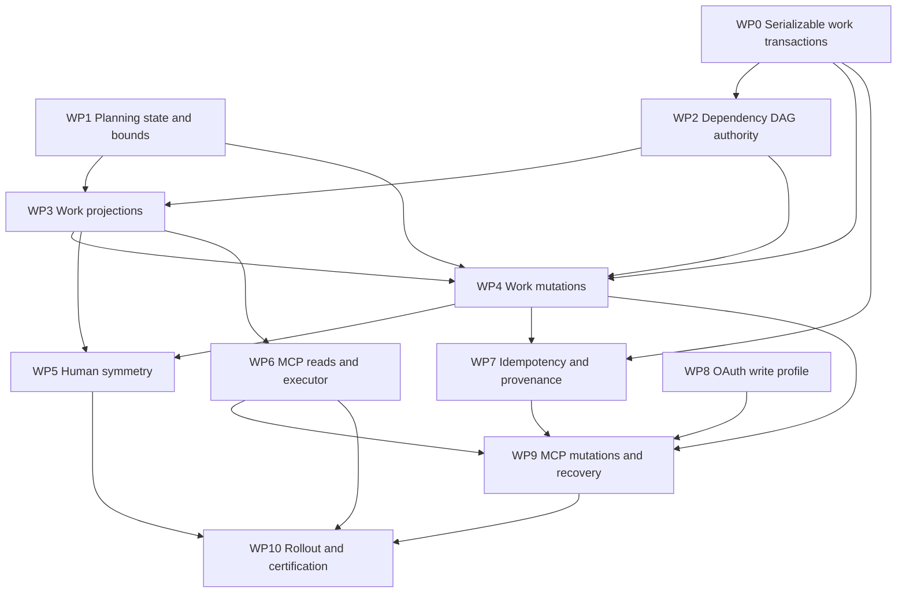

# ADR 0004 implementation plan

- Status: Proposed implementation plan
- Date: 2026-08-28
- Planning base: `454768f3a7b43b02a337add3fd387c78b4cfb47a`
- Decision: [ADR 0004](../decisions/0004-safe-mcp-work-planning.md)
- Domain authority:
  [ADR 0003](../decisions/0003-authoritative-work-planning.md)
- Execution projection:
  [ADR 0004 swarm orchestration](0004-mcp-work-planning-orchestration.md)

## Purpose and delivery rules

This plan turns ADR 0004 into dependency-aware, stackable work packages. It is
grounded in Forge at the planning base above. It does not implement production
code, accept any Proposed ADR, or reopen ADR 0003.

Each package is an independently reviewable pull request or a short stack of
mechanically inseparable pull requests. A package may land with its feature
disabled. Later packages must use earlier service boundaries rather than add a
parallel transport-owned implementation. Migration numbers are provisional and
must be reassigned to the next available numbers when a stack rebases.

The implementation coordinator must keep these invariants visible in every
package:

- native Project, Issue, membership, dependency, pull request, and check rows
  remain the only work facts;
- planning state is the only persisted plan-specific domain fact;
- MCP receipts are protocol safety and provenance records, not Work state;
- ordinary Projects remain unchanged until explicit opt-in;
- human, REST where applicable, and MCP paths share domain operations;
- Forge never adopts, assigns, schedules, dispatches, or supervises execution;
  and
- no package introduces claims, leases, semantic duplicate detection, GraphQL,
  a generic projection engine, generic MCP CRUD, or an agent registry.

## Repository receipts

The following files are the current authorities and change seams at the
planning base.

| Responsibility | Current receipt | Planning consequence |
| --- | --- | --- |
| Project schema/lifecycle | [`models/project/project.go`](../../../models/project/project.go) | Add narrow planning state and active-plan guards |
| Project membership | [`models/project/issue.go`](../../../models/project/issue.go) | Preserve the unique Project/Issue relation and default-column invariant |
| Whole-set membership mutation | [`models/issues/issue_project.go`](../../../models/issues/issue_project.go) | Extract a one-plan set operation; do not replace unrelated memberships |
| Issue identity/content | [`models/issues/issue.go`](../../../models/issues/issue.go) | Work refs use Issue number; Markdown uses `ContentVersion` |
| Issue conditional writes | [`models/issues/issue_update.go`](../../../models/issues/issue_update.go) | Add conditional title and combined transactional persistence |
| Issue service/effects | [`services/issue`](../../../services/issue) | Split transaction-safe cores from post-commit effects |
| Dependency persistence | [`models/issues/dependency.go`](../../../models/issues/dependency.go) | Move full DAG and permission authority into shared service |
| Dependency transports | [`routers/web/repo/issue_dependency.go`](../../../routers/web/repo/issue_dependency.go), [`routers/api/v1/repo/issue_dependency.go`](../../../routers/api/v1/repo/issue_dependency.go) | Migrate existing callers to the shared operation |
| Delivery references | [`models/issues/issue_xref.go`](../../../models/issues/issue_xref.go) | Batch latest effective closing reference per target Issue |
| Base-repository checks | [`models/git/commit_status.go`](../../../models/git/commit_status.go) | Reuse batch revision status authorities |
| Frozen pull inspection | [`services/pull/inspection.go`](../../../services/pull/inspection.go) | Reuse permission, cursor, revision, and budget patterns |
| Transactions | [`models/db/context.go`](../../../models/db/context.go) | Add a narrow serializable/retry seam; do not alter ordinary `WithTx` |
| Project HTML | [`routers/web/repo/projects.go`](../../../routers/web/repo/projects.go) | Replace direct model lifecycle calls with work operations |
| Repository units | [`services/repository/setting.go`](../../../services/repository/setting.go) | Guard active plans before disabling required units |
| MCP endpoint | [`routers/mcp/mcp.go`](../../../routers/mcp/mcp.go) | Register semantic tools and one shared executor |
| MCP authentication | [`routers/mcp/auth.go`](../../../routers/mcp/auth.go) | Carry verified grant/profile; fix space-delimited scope parsing |
| MCP tool precedent | [`routers/mcp/pull_inspection.go`](../../../routers/mcp/pull_inspection.go) | Preserve structured envelopes, annotations, and disclosure behavior |
| MCP settings | [`modules/setting/mcp.go`](../../../modules/setting/mcp.go) | Add off-by-default work read/write enablement |
| OAuth fixed profile | [`services/oauth2_provider/mcp_profile.go`](../../../services/oauth2_provider/mcp_profile.go) | Generalize to separate exact read and write clients |
| OAuth token verification | [`services/oauth2_provider/access_token_verification.go`](../../../services/oauth2_provider/access_token_verification.go) | Preserve principal, audience, grant, scope, and credential identity |
| OAuth application/grant | [`models/auth/oauth2.go`](../../../models/auth/oauth2.go) | One grant per user/application requires a second write client |
| OAuth scope vocabulary | [`models/auth/access_token_scope.go`](../../../models/auth/access_token_scope.go) | Reuse exact repository/Issue scopes; do not create MCP permission semantics |
| OAuth consent | [`routers/web/auth/oauth2_provider.go`](../../../routers/web/auth/oauth2_provider.go), [`templates/user/auth/grant.tmpl`](../../../templates/user/auth/grant.tmpl) | Add explicit write-profile consent and strict scope handling |
| Migration registry | [`models/migrations/migrations.go`](../../../models/migrations/migrations.go) | Current registry ends at version 343 |
| Migration pattern | [`models/migrations/v1_27/v343.go`](../../../models/migrations/v1_27/v343.go) | Add focused, tested migrations under the current release directory |
| MCP conformance tests | [`tests/integration/mcp_oauth_conformance_test.go`](../../../tests/integration/mcp_oauth_conformance_test.go) | Extend audience, scope, refresh, and consent matrix |
| MCP integration tests | [`tests/integration/mcp_test.go`](../../../tests/integration/mcp_test.go) | Cover discovery, calls, errors, cancellation, and limits |
| Dependency guard | [`.golangci.yml`](../../../.golangci.yml) | MCP handlers must not import API or web layers |
| Configuration/docs | [`custom/conf/app.example.ini`](../../../custom/conf/app.example.ini), [`docs/mcp.md`](../../mcp.md) | Document bounds, profiles, enablement, and upgrade behavior |

## Package dependency graph

WP0 and WP1 can start together. WP8 may proceed after ADR 0004 fixes the write
profile, but it must not enable write tools. WP5 and WP6 can stack independently
after the shared projection and mutation APIs stabilize. WP10 is evidence and
rollout, not a place to hide unfinished domain work.

## WP0: Serializable work transactions

**Scope**

Add a narrow `models/db` entry point for serializable transactions, context
cancellation, backend-specific retryable serialization/deadlock
classification, exponential jitter within a fixed budget, and at most three
complete transaction attempts. Do not change the isolation or retry behavior of
ordinary `WithTx` callers.

Begin with a time-boxed driver spike for SQLite, MySQL, PostgreSQL, and MSSQL.
Record the exact isolation request and retryable error codes for each backend.
If any supported backend cannot provide the ADR 0003 invariant, stop the stack
and return to architectural review; do not substitute process locks.

**Files and packages**

- [`models/db/context.go`](../../../models/db/context.go) and new domain-named
  transaction files beside it.
- Backend test infrastructure reached by the database targets in
  [`Makefile`](../../../Makefile).

**Acceptance evidence**

- Unit tests classify retryable and non-retryable errors without exposing raw
  SQL or driver text.
- Cancellation prevents another retry and reaches in-flight database work.
- Integration tests pass on SQLite, MySQL, PostgreSQL, and MSSQL.
- Concurrent transactions that would collectively close a cycle allow at most
  one commit.
- Retry exhaustion returns one typed retryable conflict and leaves no callback
  effect after final rollback.

## WP1: Planning state, limits, and compatibility migration

**Scope**

Add `disabled`, `draft`, and `active` planning state to the Project authority.
Use migration v344 at this base and register it after v343. Existing Projects
and newly created ordinary Projects default to `disabled`; no Project is
adopted automatically. Unknown persisted values fail safely.

Add a domain-named work settings module for graph traversal, plan size,
projection, page, mutation, text, and output bounds. Add separate off-by-default
MCP work-inspection and work-mutation flags under `[mcp]`. Existing MCP pull
inspection remains unchanged when both are off.

**Files and packages**

- [`models/project/project.go`](../../../models/project/project.go).
- New `models/migrations/v1_27/v344.go`, its test, and
  [`models/migrations/migrations.go`](../../../models/migrations/migrations.go).
- [`modules/setting/setting.go`](../../../modules/setting/setting.go), a new
  domain-named work settings file, and
  [`modules/setting/mcp.go`](../../../modules/setting/mcp.go).
- [`custom/conf/app.example.ini`](../../../custom/conf/app.example.ini).

**Acceptance evidence**

- Upgrade tests start with ordinary Projects and prove every one remains
  `disabled`; fresh and upgraded schemas agree.
- New ordinary Project behavior and existing REST/HTML responses are unchanged.
- Invalid or unsafe limits fail startup with actionable configuration errors.
- Lowering a bound does not persist a different state; an over-bound active
  plan later composes an integrity concern and no ready frontier.
- Disabled work inspection registers no new tools. Disabled mutation registers
  and advertises no write capability.

## WP2: Shared dependency DAG authority

**Scope**

Add a domain-named Issue dependency service with set-oriented `present` and
`absent` operations. It must validate self-edge, non-pull Work endpoints,
same-repository creation, current permissions, the complete transitive graph,
and bounds under WP0 serializable retry. Existing cross-repository edges remain
observable/removable for compatibility; this package does not create new ones
for Work planning.

Move HTML, REST, and later Work callers from direct model mutation to this
service. The model retains persistence. Repeated `present` or `absent` succeeds
unchanged and does not duplicate timeline comments.

**Files and packages**

- [`models/issues/dependency.go`](../../../models/issues/dependency.go).
- New focused files and tests under [`services/issue`](../../../services/issue).
- [`routers/web/repo/issue_dependency.go`](../../../routers/web/repo/issue_dependency.go).
- [`routers/api/v1/repo/issue_dependency.go`](../../../routers/api/v1/repo/issue_dependency.go).
- Permission helpers in
  [`models/perm/access/repo_permission.go`](../../../models/perm/access/repo_permission.go).

**Acceptance evidence**

- Self, duplicate, reciprocal, and cycles longer than two have unit tests.
- Disjoint concurrent edge additions cannot jointly commit a cycle on any
  supported database.
- Hidden intermediate node, actual hidden cycle, and graph-bound exhaustion
  return the same non-disclosing invalid result and make no change.
- Repeated presence/absence converges with no duplicate comments.
- HTML, REST, and Work callers have one permission and invariant result.
- Existing ordinary dependency behavior remains compatible where it does not
  violate the strengthened global DAG invariant.

## WP3: Authoritative Work projection reads

**Scope**

Create a deep `services/work` module as the only composition authority for ADR
0003 `WorkItem`, `WorkPlan`, and `PlanContext`. Add focused batch model queries
for Project membership in Issue-number order, dependency closures, effective
latest closing pull request references, frozen revisions, and base-repository
commit statuses. Reuse or extract the signed-cursor, permission, frozen-
revision, and budget patterns from pull inspection. Do not persist a projection
or build a generic resolver.

Signed cursors bind repository, Project, page kind, order, and last Issue, but
do not promise snapshot isolation. Every page rechecks permissions. Reads must
have no read-marker, history, notification, graph, or cache side effect.

**Files and packages**

- New [`services/work`](../../../services) package files and unit tests.
- Focused queries beside [`models/project/issue.go`](../../../models/project/issue.go),
  [`models/issues/dependency.go`](../../../models/issues/dependency.go), and
  [`models/issues/issue_xref.go`](../../../models/issues/issue_xref.go).
- [`models/git/commit_status.go`](../../../models/git/commit_status.go).
- Shared extraction from
  [`services/pull/inspection.go`](../../../services/pull/inspection.go) only
  where two semantic services genuinely need the same authority.

**Acceptance evidence**

- Every readable non-pull Issue composes, including an unplanned fragment;
  pull request cards are reported only as excluded Project members.
- Disabled Projects remain ordinary and never appear as Work plans.
- Draft and active plans derive every ADR 0003 state from current native facts;
  the same Issue may differ by plan context.
- Effective latest closing-reference action determines delivery, and fork-only
  statuses are not merged into base-repository evidence.
- Pagination is deterministic in Issue-number order, rejects cursor misuse, and
  explicitly requires reinspection before action.
- Hidden prerequisites fail closed without identity; active bound exhaustion
  yields no ready frontier, while draft inspection labels incompleteness.
- Query-count tests prove batch behavior rather than item-by-item database
  growth. Cancellation interrupts database and Git work.

## WP4: Shared Work mutation and lifecycle operations

**Scope**

Add semantic operations to `services/work` for draft-plan creation/opt-in,
single-plan membership, atomic Issue creation plus membership, conditional
title/Markdown revision, dependency presence through WP2, Issue close/reopen,
plan activation/return-to-draft, draft deletion, and the closed bounded plan
revision from ADR 0004.

Extract transaction-safe persistence cores from Issue services. Domain rows,
timeline rows, and provenance hooks execute in the transaction; notifications,
webhooks, indexes, and ready-work pointers run only after commit. Do not build a
general outbox in this package. If fault injection proves the existing notifier
cannot meet at-least-once post-commit delivery narrowly, document that as a
separate prerequisite rather than silently expanding WP4.

Add exact conditional title update beside the existing Markdown content
version. A combined content update validates both before changing either. Add
active-plan guards to Project deletion and repository unit changes. Archived
repositories reject mutation; unarchive merely recomposes retained facts.

**Files and packages**

- New mutation files under [`services/work`](../../../services).
- [`models/issues/issue_update.go`](../../../models/issues/issue_update.go).
- [`services/issue/issue.go`](../../../services/issue/issue.go),
  [`services/issue/content.go`](../../../services/issue/content.go), and
  [`services/issue/status.go`](../../../services/issue/status.go).
- [`models/issues/issue_project.go`](../../../models/issues/issue_project.go)
  and [`services/projects/issue.go`](../../../services/projects/issue.go).
- [`models/project/project.go`](../../../models/project/project.go) and
  [`services/repository/setting.go`](../../../services/repository/setting.go).
- Project and repository setting callers under [`routers/web`](../../../routers/web)
  and [`routers/api/v1`](../../../routers/api/v1).

**Acceptance evidence**

- Create Issue plus membership commits both or neither, always in a valid
  default column.
- Combined title/body stale failure changes neither; title, content version,
  and expected planning-state conflicts never partly write.
- Membership and dependency retries converge and preserve unrelated Project
  memberships.
- Activation validates the complete bounded authoritative graph in its
  transaction; a stale JIT plan token makes no change.
- Active plans cannot be deleted or lose Issues, Projects, or dependency units.
- Repository archive rejects mutation; unarchive recomposes without migration
  or cache repair.
- Timeline and provenance rows commit with state. Notifications and webhooks
  occur only after commit and are not duplicated by a set no-op.
- Existing human and REST behavior is preserved through shared operations.

## WP5: Human Work interface symmetry

**Scope**

Render the shared projection and invoke the shared mutations in Project, Issue,
and relevant pull request views. Show planning state, explicit integrity or
bound concerns, selected-context readiness, delivery references, and MCP origin
without inventing workflow columns or execution status. Ordinary disabled
Projects retain their existing display and controls.

**Files and packages**

- [`routers/web/repo/projects.go`](../../../routers/web/repo/projects.go) and
  relevant Issue/pull view routers under [`routers/web/repo`](../../../routers/web/repo).
- [`templates/projects`](../../../templates/projects),
  [`templates/repo/issue/sidebar`](../../../templates/repo/issue/sidebar), and
  [`templates/repo/issue/view_content`](../../../templates/repo/issue/view_content).
- [`options/locale/locale_en-US.json`](../../../options/locale/locale_en-US.json).

**Acceptance evidence**

- Browser and integration tests prove HTML and service projections agree.
- Permission-filtered HTML contains no hidden Issue, repository, delivery, or
  provenance identifier.
- Users can understand draft/active transitions, guarded deletion, and bound
  concerns without treating columns as work state.
- Provenance says MCP used the principal's authority and actor is unverified; it
  never claims the principal personally acted.
- No adoption, claim, lease, executor, dispatcher, or scheduler control appears.

## WP6: MCP read tools and shared execution boundary

**Scope**

Move capacity and timeout handling from the pull tool into one endpoint-wide
executor shared by every tool. Register `work_item.inspect` and
`work_plan.inspect` with ADR 0004's standalone schemas and annotations. Map only
through `services/work`; preserve `pull_request.inspect` behavior and the
existing read OAuth and PAT compatibility.

**Files and packages**

- [`routers/mcp/mcp.go`](../../../routers/mcp/mcp.go),
  [`routers/mcp/pull_inspection.go`](../../../routers/mcp/pull_inspection.go),
  and new domain-named tool files under [`routers/mcp`](../../../routers/mcp).
- [`modules/setting/mcp.go`](../../../modules/setting/mcp.go).
- Unit tests under [`routers/mcp`](../../../routers/mcp) and integration tests in
  [`tests/integration/mcp_test.go`](../../../tests/integration/mcp_test.go).

**Acceptance evidence**

- Registered schemas match ADR 0004 and have no generic resource escape hatch.
- Existing pull inspection and read credentials work unchanged.
- Missing, denied, hidden dependency, and bound failures are non-disclosing.
- Invalid cursor, pagination, body/output limits, cancellation, timeout, and
  busy behavior have official SDK tests.
- Concurrent calls across different tools share one configured capacity; tool
  registration does not multiply it.
- MCP dependency guards and repository lint remain green.

## WP7: Durable idempotency and provenance substrate

**Scope**

Add a narrow MCP-work operation receipt and artifact/event links. Use migration
v345 at this base. Persist operation identity, domain-separated RFC 8785 HMAC
key/request digests,
principal, fixed OAuth application and grant, token `jti`, exact scope snapshot,
unverified actor, MCP origin, final outcome, timestamps, and stable affected
references. Add a compact retained tombstone if privacy policy deletes receipt
detail. Do not store raw keys/tokens, Markdown, request bodies, current Work
projection, readiness, or a generic audit event.

Insert/finalize the receipt in the same WP0 transaction as domain facts and
timeline events. Provide matching-request replay, different-request conflict,
concurrent duplicate exclusion, and post-ambiguous-commit lookup. The service
returns stored stable refs plus a fresh WP3 projection.

**Files and packages**

- New focused model/service files in the smallest domain-owned location; do not
  put receipt policy in MCP routers.
- New `models/migrations/v1_27/v345.go`, its migration test, and
  [`models/migrations/migrations.go`](../../../models/migrations/migrations.go).
- Native Issue timeline and Project-view provenance seams in
  [`models/issues/comment.go`](../../../models/issues/comment.go) and Project
  service/view code.

**Acceptance evidence**

- Same key/request sequentially, concurrently, and after response loss executes
  once and resolves the same stable references.
- Same key/different request conflicts without revealing the earlier target;
  the same key under another principal remains independent.
- Injected rollback never produces a completed receipt. Injected ambiguous
  commit recovers or returns `outcome_unknown` for identical retry.
- A set no-op records `unchanged` but emits no duplicate timeline event.
- Revoked permissions on replay return the receipt with an unavailable current
  projection; no stored projection leaks.
- Database, log, error, and UI tests prove no token, raw key, request Markdown,
  client-supplied actor, or hidden reference escapes.
- Receipt/tombstone retention prevents successful creation-key reuse for the
  artifact lifecycle.

## WP8: Fixed OAuth work-write profile and consent

**Scope**

Generalize the built-in MCP OAuth seam to keep the existing read application
and add one distinct fixed public write application. The exact canonical write
scope is `read:repository write:issue write:repository`; the audience remains
the canonical MCP resource. Add a random required access-token `jti`. Carry
verified application, grant, `jti`, profile, and scope into MCP context for
WP7, without exposing them in tool output.

Fix MCP scope parsing to use OAuth's space delimiter. Accept members in any
order, canonicalize the exact set, and reject empty, duplicate, unknown, or
additional scopes throughout authorization code, token exchange, refresh,
verification, metadata, and challenge paths.
Add explicit write-profile consent. PAT and the existing read client remain
read-only. When mutations are disabled, the write application is not offered
and write scopes/tools are not advertised.

**Files and packages**

- [`models/auth/oauth2.go`](../../../models/auth/oauth2.go) and
  [`models/auth/access_token_scope.go`](../../../models/auth/access_token_scope.go).
- [`services/oauth2_provider/mcp_profile.go`](../../../services/oauth2_provider/mcp_profile.go),
  [`services/oauth2_provider/access_token.go`](../../../services/oauth2_provider/access_token.go),
  and [`services/oauth2_provider/access_token_verification.go`](../../../services/oauth2_provider/access_token_verification.go).
- [`routers/web/auth/oauth2_provider.go`](../../../routers/web/auth/oauth2_provider.go)
  and [`templates/user/auth/grant.tmpl`](../../../templates/user/auth/grant.tmpl).
- [`routers/mcp/auth.go`](../../../routers/mcp/auth.go) and
  [`routers/mcp/mcp.go`](../../../routers/mcp/mcp.go).
- Existing unit tests beside these files and
  [`tests/integration/mcp_oauth_conformance_test.go`](../../../tests/integration/mcp_oauth_conformance_test.go).

**Acceptance evidence**

- Existing read grants and refresh tokens continue to work unchanged.
- Write consent is always explicit and accurately describes semantic authority
  and its non-execution boundary.
- Read tokens and PATs cannot call enabled write tools; permission-neutral tool
  discovery does not grant authority. Write tokens cannot authorize REST.
- Wrong audience, client, redirect, duplicate scope, missing scope,
  PKCE verifier, revoked grant, refresh counter, inactive principal, and expired
  token have negative tests.
- Repository and unit permissions are checked after scope on every target.
- Protected Resource Metadata and challenges advertise exact enabled profiles
  without principal-specific repository disclosure.

## WP9: MCP mutations and ambiguous-result recovery

**Scope**

Register `work_plan.begin`, `work_item.revise`, and `work_plan.revise` behind
explicit mutation enablement. Each handler validates its closed schema, exact
write profile, current permissions, bounds, and idempotency, then calls one WP4
operation through WP7. It returns the committed receipt, stable references, and
a fresh permission-filtered WP3 projection. It never interprets an arbitrary
operation array or calls model persistence directly.

Map deterministic rejection, serializable retry, stale precondition,
cancellation before commit, cancellation after commit, response construction
failure, and ambiguous commit to ADR 0004's exact outcomes. Add no generic
receipt CRUD tool; replaying the identical mutation is the recovery operation.

**Files and packages**

- New semantic tool files and schema tests under
  [`routers/mcp`](../../../routers/mcp).
- [`routers/mcp/mcp.go`](../../../routers/mcp/mcp.go) and
  [`routers/mcp/auth.go`](../../../routers/mcp/auth.go).
- Service fault-injection tests under the WP4/WP7 packages.
- [`tests/integration/mcp_test.go`](../../../tests/integration/mcp_test.go) and
  [`tests/integration/mcp_oauth_conformance_test.go`](../../../tests/integration/mcp_oauth_conformance_test.go).

**Acceptance evidence**

- Official Go SDK tests cover all three tool schemas and every ADR 0003
  workflow mapping.
- Any invalid sub-change rolls back the complete plan revision, including
  created Issues, membership, edges, timeline, and receipt.
- Same-key replay and set-oriented retries converge; stale guarded writes return
  safe reinspection guidance with no hidden current value.
- Read-after-write reflects committed native state. A post-commit projection
  failure remains a committed result, not a reported rollback.
- Cancellation before commit rolls back; disconnect or cancellation after
  commit is recovered by identical retry.
- Scope and permissions are checked before resource-specific disclosure.
- Mutation flags off remove write tools and the issuable write profile.

## WP10: Compatibility, rollout, and certification

**Scope**

Update operator and client documentation, complete the security matrix, run
cross-backend and MCP interoperability suites, and enable in stages. Do not
change ADR status until its dependencies and acceptance evidence permit it.

Roll out in this order:

1. Land schema and settings with every Project `disabled` and every new MCP
   capability off.
2. Land serializable dependency authority and shared Work projection.
3. Land shared mutations and human views; adopt only explicitly selected
   repository Projects.
4. Enable MCP read tools independently while mutation remains off.
5. Land receipts and the write OAuth profile while write tools remain off.
6. Enable write tools only after security, fault-injection, and cross-backend
   evidence is complete.
7. Let repository owners opt Projects into draft and activate them explicitly.

A ready-work notification, if delivered, is a separate small package after WP4.
It uses the existing notification/webhook seam and carries only repository,
Project, Issue, and revision identifiers. It never chooses a consumer,
schedules, retries execution, or includes copied Issue prose.

**Files and packages**

- [`docs/mcp.md`](../../mcp.md),
  [`custom/conf/app.example.ini`](../../../custom/conf/app.example.ini), and
  administrator upgrade and security documentation selected during delivery.
- Relevant unit, integration, database, template, and browser tests named by
  WP0 through WP9.
- ADR status and decision-log files only after accepted evidence exists.

**Acceptance evidence**

- Upgrade and rollback compatibility is documented and tested; disabled and
  read-only configurations preserve ADR 0002 behavior.
- Security tests cover anonymous, read OAuth, write OAuth, PAT, wrong audience,
  missing unit/repository permission, hidden dependency, archived repository,
  disabled unit, stale request, duplicate key, and ambiguous commit.
- Cross-backend serialization, official MCP SDK interoperability, query-count,
  timeout, cancellation, capacity, and output-bound suites pass.
- Repository Markdown lint, Mermaid parsing, links/receipts, whitespace, and
  disclosure guardrails pass for implementation documentation and fixtures.
- Logs, examples, fixtures, consent, and error text contain no secrets or
  deployment-specific operational details.
- The decision log still marks ADR 0003 and ADR 0004 Proposed until ADR 0001 is
  accepted and each decision has the required implementation evidence.

## Stacked-PR execution checklist

For every package, the implementation coordinator must:

1. rebase onto the immediately preceding stack commit and confirm migration
   numbers are still free;
2. state the package's authority boundary and explicitly list deferred work;
3. add the smallest unit tests first, then only the integration/browser/database
   tests needed for cross-boundary claims;
4. run `make fmt` for Go changes, `make lint-go`, `make lint-js` for TypeScript,
   targeted Go or Vitest tests, and the package-specific evidence above;
5. scan the complete diff, commit message, proposed pull request text, fixtures,
   logs, and screenshots for secrets and operational details;
6. use a Conventional Commit title and the required `Assisted-by` trailer; and
7. never amend, squash, force-push, enable a production feature, or change ADR
   status without explicit human direction.

The implementation coordinator should stop and return to architectural review
if a package requires a persisted plan revision, copied readiness/delivery
state, cross-repository plan mutation, generic batch language, verified actor
claim without a credential, or any Forge-owned execution lifecycle.
