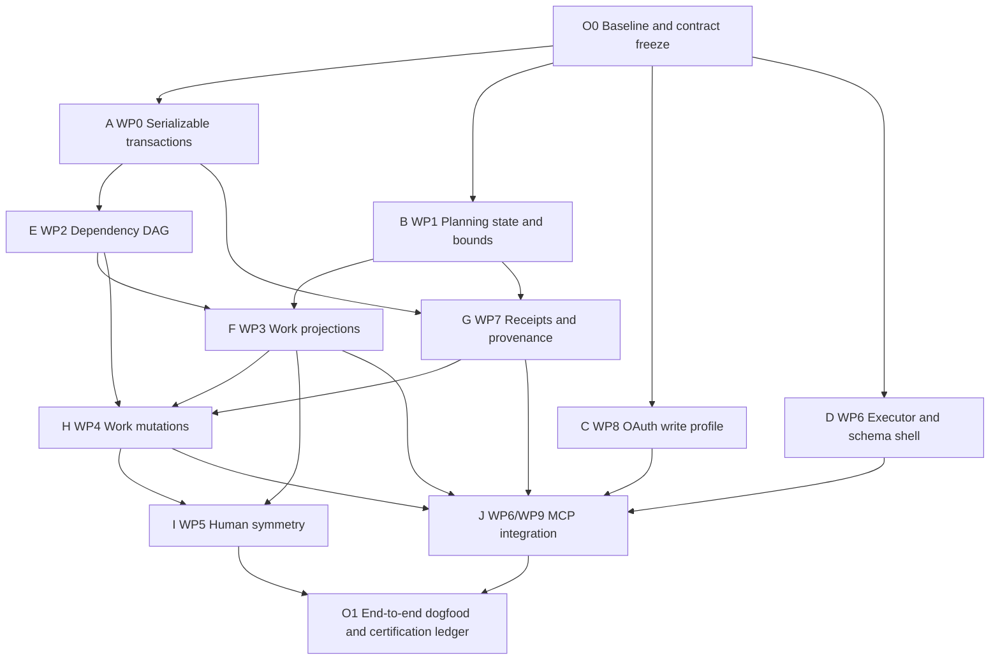
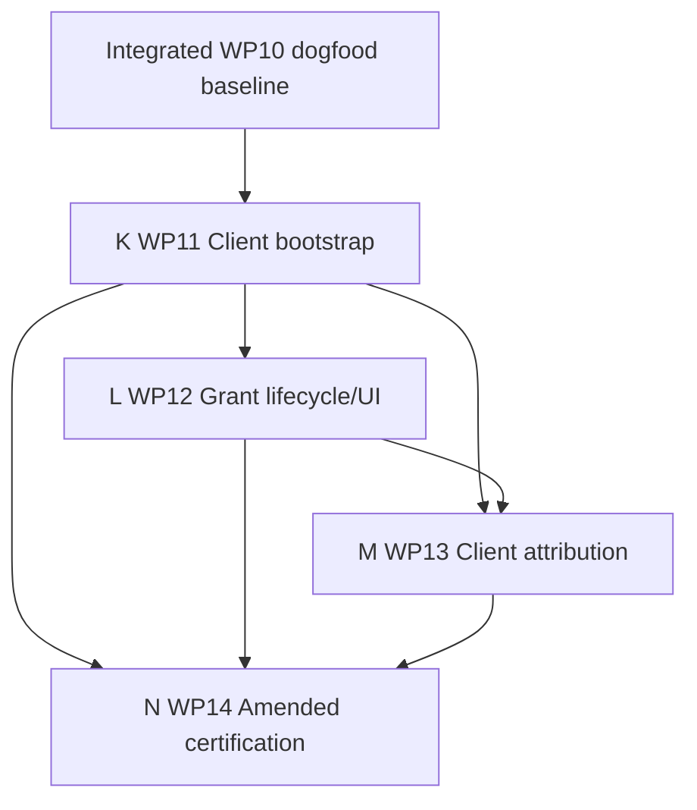

# ADR 0004 swarm orchestration projection

- Status: Proposed execution projection
- Date: 2026-08-28
- Amended: 2026-08-29
- Planning base: `d0d7a98b60c508ae343851d2f9c175963709cf49`
- Amendment base: `233dc10123457fb9f69ba425cdf2586371b5a869`
- Decision: [ADR 0004](../decisions/0004-safe-mcp-work-planning.md)
- Implementation packages:
  [ADR 0004 implementation plan](0004-mcp-work-planning-implementation.md)
- Amendment execution:
  [client-onboarding delegated execution](0004-mcp-client-onboarding-orchestration.md)

## Objective

Coordinate an agent swarm to produce a locally usable, off-by-default ADR 0004
vertical slice in one focused session while preserving a credible path to full
certification. The target is four to five hours of wall-clock time with at most
four implementation or review agents active concurrently.

The swarm is an execution technique, not a reason to weaken the decisions. ADR
0003 remains the authoritative work domain. Agents may divide implementation,
tests, and review, but they may not introduce copied Work state, generic MCP
CRUD, a generic projection engine, claims, leases, an agent registry, or
Forge-owned adoption, scheduling, dispatch, harness, or execution state.

The orchestrator owns integration. Workers own bounded packages and evidence.
Reviewers do not edit a builder's branch. Original WP0-WP10 workers did not
recursively delegate; amendment threads follow the bounded rule below.

The deliverable ends at a validated local build and image-ready source state.

The 2026-08-29 amendment re-enters orchestration from the integrated WP10
dogfood baseline. It adds WP11 through WP14 for per-installation OAuth client
bootstrap, grant-owned profiles and authority inspection, required
client-reported mutation attribution, and a new security certification. The
original swarm record remains useful evidence; it is not rewritten to imply
those later obligations were already delivered.

## Two finish lines

The orchestrator must keep the dogfood milestone distinct from full ADR
completion.

### Tonight: locally usable dogfood

The session succeeds when a local, feature-gated build can demonstrate:

- an ordinary repository Project remains unchanged until explicit opt-in;
- an authorized MCP client can create or begin a draft plan;
- one atomic plan revision can create Issues, add membership, add dependencies,
  and activate a valid plan;
- `work_item.inspect` and `work_plan.inspect` compose native state and a ready
  frontier through the shared Work service;
- the same idempotency key and request replays one outcome, while a different
  request conflicts;
- stale content and plan preconditions make no partial change;
- a cycle and an unreadable or over-bound dependency path fail closed;
- a committed mutation returns stable references and a fresh read-after-write
  projection;
- the human Project or Issue surface shows planning state and honest MCP
  provenance sufficient for local dogfood;
- read OAuth and PAT credentials cannot mutate, while the Work Planning profile
  requires explicit consent and current repository/unit permissions; and
- all new capability remains disabled by default.

This milestone is real functionality, not a mock. It may be used locally after
the final gate passes. It does not by itself mark ADR 0004 Implemented or
authorize broad rollout.

### Full ADR 0004 completion

The decision is complete only after every WP0-WP14 acceptance item has evidence,
including the supported-database concurrency matrix, exhaustive ambiguous-
commit and cancellation fault injection, complete human-interface symmetry,
client-bootstrap abuse and redirect coverage, grant-lineage transition,
required attribution, compatibility coverage, documentation, and staged
rollout certification.

The orchestrator records any evidence not completed tonight as an explicit
remaining obligation. It must never convert an unavailable database or test
environment into a passing claim.

## Operating model

### Integration authority

One orchestrator owns:

- the integration worktree and current stack base;
- package dispatch and dependency release;
- the authoritative finding and evidence ledger outside the repository;
- resolution of overlapping files and migration ordering;
- local aggregate gates after every integration wave;
- final end-to-end dogfood execution; and
- the statement of what is complete, partial, blocked, or deferred.

The orchestrator does not implement a large package while workers are active.
It may make narrow integration-only changes: registry stitching, mechanical
conflict resolution, test-fixture wiring, and documentation corrections. Any
semantic correction returns to the owning builder.

### Worker branches and commits

Each worker receives a separate worktree rooted at the orchestrator-provided
stack base and uses a `codex/adr-0004-<package>` branch. The orchestrator may
substitute another approved prefix for a non-Codex worker, but branch purpose
must remain explicit.

Each worker:

1. reads ADRs 0001-0004 and its complete WP assignment before editing;
2. changes only its owned packages and declared integration seams;
3. preserves relevant comments and unrelated worktree changes;
4. runs the package gate and records exact commands/results;
5. scans its complete diff and proposed handoff text for secrets and
   operational details;
6. commits with a Conventional Commit and the required `Assisted-by` trailer;
   and
7. hands the commit, test evidence, known gaps, and review-ledger path to the
   orchestrator without pushing or opening a pull request unless authorized.

The orchestrator rebases or cherry-picks only completed package commits onto the
current integration head. A handoff with uncommitted semantic changes is not
accepted.

### Cross-family review

Risk-bearing packages receive one read-only opposing-family review before
integration:

- Claude reviews Codex-built packages through `claude-loop`.
- Codex reviews Claude-built packages through the corresponding `codex-loop`.

The review target is the package's ADR obligations and diff, not an open-ended
style review. The builder owns triage and classifies each finding as:

- `fix-now`;
- `prove-with-test`;
- `document-boundary`;
- `separate-decision`; or
- `decline`, with evidence.

Follow-up review checks only earlier missing, partial, or contradicted items.
The loop stops when every declared obligation is complete, intentionally
deferred, or explicitly classified—not when the reviewer runs out of ideas.
The review ledger lives outside the repository and follows the commit through
orchestrator handoff.

Mandatory cross-family review applies to WP0, WP2, WP4, WP7, WP8, WP9, WP11,
WP12, and WP13.
WP1, WP3, WP5, and WP6 may use orchestrator review when their diff is mechanical
or completely covered by a downstream mandatory review. The orchestrator may
escalate any package to opposing-family review.

## Labor projection

Agents are labeled by responsibility rather than identity. The orchestrator may
assign either family to a build seat, provided the opposing family reviews the
risk-bearing handoff.

The default family split balances the first three waves and makes every
high-risk handoff naturally reviewable by the other family:

| Agent | Default builder | Package |
| --- | --- | --- |
| A | Codex | WP0 serializable transaction primitive |
| B | Claude | WP1 planning state and bounds |
| C | Claude | WP8 OAuth write profile |
| D | Codex | WP6 execution and schema shell |
| E | Codex | WP2 dependency DAG authority |
| F | Claude | WP3 Work projections |
| G | Claude | WP7 idempotency and provenance |
| H | Codex | WP4 Work mutations |
| I | Claude | WP5 human symmetry |
| J | Codex | WP6/WP9 MCP integration |

### Agent A: Serializable transaction primitive — WP0

**Owns**

- narrow serializable transaction and bounded-retry seam under `models/db`;
- backend retry classification, cancellation, and typed exhaustion errors; and
- focused concurrency/fault tests.

**Must not touch**

- Project planning state, MCP handlers, OAuth, or Work projection semantics.

**Handoff evidence**

- targeted `models/db` tests;
- one concurrent invariant demonstration on the locally available database;
- exact remaining backend-matrix obligations; and
- opposing-family review closure.

### Agent B: Planning state and bounds — WP1

**Owns**

- Project planning-state model and migration v344 at this base;
- domain work bounds and off-by-default MCP work flags;
- migration/default/compatibility tests; and
- example configuration.

**Must not touch**

- dependency semantics, OAuth, receipt persistence, or MCP tool handlers.

**Handoff evidence**

- migration test proving existing Projects become `disabled`;
- fresh/upgrade schema agreement;
- configuration validation tests; and
- ordinary Project compatibility tests.

### Agent C: Fixed OAuth write profile — WP8

**Owns**

- the second fixed MCP OAuth application;
- exact write-scope canonicalization and space-delimited parsing;
- token `jti`, verified credential context, consent, metadata, and challenges;
- read-client and PAT compatibility; and
- OAuth conformance tests.

**Must not touch**

- Work domain services, Project/Issue mutation, or receipt storage.

**Handoff evidence**

- wrong-audience/scope/client/PKCE negative tests;
- read-grant compatibility;
- REST audience isolation;
- explicit consent rendering; and
- opposing-family review closure.

### Agent D: MCP execution and schema shell — WP6 base

**Owns**

- one endpoint-wide capacity/timeout executor;
- generated or typed ADR 0004 schemas and error-envelope mapping;
- read-tool handler shells against the declared Work service interface; and
- official SDK schema, cancellation, timeout, and capacity tests.

**Must not touch**

- Work projection logic, OAuth policy, Issue/Project persistence, or receipts.

**Handoff evidence**

- existing `pull_request.inspect` compatibility;
- schema fixtures for all five tools;
- proof that adding tools does not multiply capacity; and
- handler tests using fakes until WP3 is integrated.

### Agent E: Dependency DAG authority — WP2

**Starts after** WP0 is integrated.

**Owns**

- set-oriented dependency presence in the shared Issue service;
- complete bounded cycle validation under serializable retry;
- HTML/REST migration from direct model mutation; and
- permission/non-disclosure/concurrency tests.

**Must not touch**

- Work projection shapes, OAuth, MCP handlers, or receipt persistence.

**Handoff evidence**

- self, reciprocal, transitive, concurrent, hidden-path, and bound tests;
- repeated present/absent convergence;
- HTML/REST shared-authority proof; and
- opposing-family review closure.

### Agent F: Work projections — WP3

**Starts after** WP1 is integrated and the WP2 service interface is frozen. It
may build against that interface while WP2 tests finish.

**Owns**

- `services/work` read composition;
- batch membership, dependency, delivery-reference, revision, and check queries;
- signed non-snapshot pagination; and
- derived state, bounds, permission filtering, and query-count tests.

**Must not touch**

- native fact definitions, MCP schemas, OAuth, or mutation receipts.

**Handoff evidence**

- unplanned Issue, multi-plan context, excluded PR card, delivery/check mapping,
  hidden prerequisite, bound, pagination, and side-effect-free read tests;
- query-count evidence; and
- stable exported service contract for WP4/WP6.

### Agent G: Idempotency and provenance — WP7

**Starts after** WP0 and WP1 are integrated. It may establish the receipt model
and service while WP4 supplies the final mutation callback.

**Owns**

- migration v345 and the narrow MCP-work receipt/tombstone model;
- RFC 8785 request canonicalization and domain-separated HMAC digests;
- duplicate exclusion, replay, conflict, ambiguous-outcome lookup, and retention;
- provenance links and permission-filtered presentation contract; and
- fault-injection tests around the service seam.

**Must not touch**

- Work state derivation, OAuth issuance, MCP handler schemas, or generic audit.

**Handoff evidence**

- same-key same/different-request, concurrent duplicate, rollback, response
  loss, permission-revoked replay, and secret-non-persistence tests;
- migration ordering after v344; and
- opposing-family review closure.

### Agent H: Shared Work mutations — WP4

**Starts after** WP2 and WP3 are integrated and WP7's receipt callback is
frozen.

**Owns**

- semantic plan begin, item revision, plan revision, activation/draft/delete,
  membership, dependency, and Issue lifecycle operations;
- transaction-safe persistence cores and post-commit effects;
- JIT plan-token validation;
- active-plan repository lifecycle guards; and
- atomicity, stale-write, notification, and rollback tests.

**Must not touch**

- MCP transport schemas, OAuth issuance, or human templates beyond service
  contracts.

**Handoff evidence**

- create+member+edge+activation all-or-nothing proof;
- combined title/body stale proof;
- active-plan and archive guards;
- post-commit-only effect proof; and
- opposing-family review closure.

### Agent I: Human symmetry — WP5

**Starts after** WP3 and the stable WP4 interface are available.

**Owns**

- Project/Issue/pull view composition through `services/work`;
- draft/active controls through shared mutations;
- integrity, bound, delivery, and MCP-origin presentation;
- locale/templates; and
- permission-filtered browser/integration tests.

**Must not touch**

- domain persistence, OAuth, MCP handlers, or agent/execution concepts.

**Handoff evidence**

- ordinary Project visual compatibility;
- no hidden identity in markup;
- honest original-slice unverified-actor wording, superseded by WP13; and
- focused human/MCP symmetry tests.

### Agent J: MCP mutations and end-to-end contract — WP6/WP9 completion

**Starts after** WP3, WP4, WP7, WP8, and Agent D's executor/schema shell are
integrated.

**Owns**

- binding all five handlers to shared Work operations;
- scope/permission/error/read-after-write mapping;
- ambiguous-result recovery through identical mutation replay; and
- official SDK end-to-end tests for every ADR 0003 workflow.

**Must not touch**

- native persistence, OAuth issuance, or human-interface semantics.

**Handoff evidence**

- full inspect/begin/revise dogfood scenario;
- PAT/read-token write rejection;
- stale, hidden, cancellation, post-commit response failure, and replay tests;
- off-by-default discovery behavior; and
- opposing-family review closure.

## Dependency and dispatch graph



No downstream agent starts from an unreviewed semantic commit. An agent may
prepare tests or compile-time interfaces early, but the orchestrator supplies a
reviewed integration base before final implementation and handoff.

## Amendment re-entry orchestration

The dedicated
[client-onboarding delegated execution](0004-mcp-client-onboarding-orchestration.md)
supersedes this section's Agent K-N seat assignments and WP11-WP14 execution
mechanics. This section's semantic boundaries and gates remain authoritative.

The extension uses new branches from the integrated WP10 baseline. It does not
reopen the original package branches or hide new semantics in a documentation
or certification commit.

The integrated source baseline is retained; the running pre-release dogfood
substrate is not. Before interface validation, stop it, discard its database
and credentials, and recreate it from an empty database with the amended build.
This pre-release slice has no supported client or deployment data to migrate,
so no worker may add compatibility aliases, receipt backfills, dual-read
schemas, or fixed-client transition code.

| Agent | Default builder | Package | Review floor |
| --- | --- | --- | --- |
| K | Codex | WP11 constrained MCP client bootstrap | Fable 5 OAuth/abuse review |
| L | Codex | WP12 grant lifecycle and authority UI | Fable 5 OAuth/token review |
| M | Codex | WP13 operation client attribution | Opus 5 provenance/idempotency review; escalate to Fable 5 for any security dispute |
| N | Codex | WP14 conformance, docs, and dogfood | Fable 5 focused ADR review |

Each implementing thread may use at most two non-recursive sub-agents for
bounded tests or investigation. The implementing thread retains semantic
ownership and must inspect every contributed diff. Reviewers remain read-only
and never share the builder's model family.

### Agent K: MCP client bootstrap — WP11

**Owns**

- provisional and finalized MCP OAuth client registration lifecycle;
- closed public-client metadata and redirect validation;
- bootstrap discovery, enablement, admission limits, expiry, and cleanup;
- clean-slate fixed-client replacement; and
- conformance and abuse tests.

**Must not touch**

- grant profile transition, Work receipt semantics, or human operation
  provenance beyond interfaces explicitly agreed with L and M.

**Handoff evidence**

- no-authority-before-consent proof;
- redirect, PKCE, audience, rate, capacity, expiry, cleanup, race, and
  cross-principal negative tests;
- immutable finalized metadata, bound-principal deletion, client-provided
  consent marker, callback context, and accepted instance-cap availability
  tradeoff;
- ordinary OAuth application compatibility; and
- Fable 5 review closure.

### Agent L: Grant lifecycle and authority inspection — WP12

**Starts after** K's registration model and service contract are reviewed.

**Owns**

- exact profile derivation from grant scope;
- atomic scope-profile replacement and old-lineage invalidation;
- consent and reconnect/revoke lifecycle; and
- the principal-facing grant authority inspection view.

**Must not touch**

- client bootstrap admission, Work receipt schema, or model/harness policy.

**Handoff evidence**

- read-to-write and write-to-read transition fault tests;
- old code/access/refresh rejection;
- independent same-label installation rotation and revocation;
- settings and consent browser tests with hostile registered metadata; and
- Fable 5 review closure.

### Agent M: Required operation attribution — WP13

**Starts after** K and L freeze registration/grant snapshot interfaces. It may
prepare SDK request-metadata tests earlier without changing receipt semantics.

**Owns**

- standard `clientInfo` and custom model metadata extraction and validation;
- receipt migration and bounded attribution snapshots;
- idempotency exclusion and replay behavior;
- output schema and human operation provenance; and
- privacy, escaping, legacy-session, and stateless-request tests.

**Must not touch**

- OAuth registration or grant authority, Work domain semantics, or an actor or
  model registry.

**Handoff evidence**

- rejection-before-mutation proof;
- changed-attribution replay proof;
- fresh-database receipt schema with no compatibility path;
- no prompt/request/credential retention proof;
- human wording that separates authority from client report; and
- Opus 5 review closure, with Fable 5 escalation for unresolved security
  findings.

### Agent N: Amended certification — WP14

**Starts after** K, L, and M are reviewed and integrated.

**Owns**

- cross-boundary OAuth/MCP/browser conformance;
- two-installation dogfood, profile transition, revoke, reconnect, and abuse
  scenarios;
- operator/client documentation and disclosure scan; and
- the amended evidence ledger and final status report.

**Must not touch**

- semantic production code except a correction returned to and committed by
  the owning builder.

**Handoff evidence**

- WP14's complete matrix with unavailable environments marked unproven;
- Fable 5 focused ADR-conformance closure;
- all new capabilities still disabled by default; and
- no operational detail in the repository or proposed collaboration text.

The extension dependency graph is:



## Projected schedule

The times are coordination budgets, not permission to skip evidence. The
orchestrator reprojects immediately when a gate fails.

| Wall time | Active work | Orchestrator action | Exit condition |
| --- | --- | --- | --- |
| 00:00-00:20 | Preflight | Confirm clean base, toolchain, baseline tests, and contracts | Baseline ledger open; no unexplained failure |
| 00:20-01:20 | Agents A, B, C, D | Review as results arrive; integrate WP0/WP1 first | Transaction, state, and protocol shells compile and pass package gates |
| 01:20-02:25 | Agents E, F, G; D/C follow-ups | Continuously integrate reviewed commits; freeze Work/receipt interfaces | DAG, projection, and receipt services pass aggregate domain gate |
| 02:25-03:35 | Agents H, I preparation, J preparation | Integrate WP4; release final interfaces to I/J | Atomic shared mutations and post-commit effects pass |
| 03:35-04:20 | Agents I and J | Integrate human and MCP seams; run focused follow-ups | End-to-end local binary builds; dogfood scenario starts |
| 04:20-05:00 | No new feature packages | Run final gates, dogfood, disclosure scan, ledger/status report | Tonight finish line passes or exact blockers are recorded |

If WP0, WP2, WP4, WP7, or WP8 misses its gate by more than 30 minutes, the
orchestrator stops launching dependents that could conceal the failure. It may
reduce tonight's finish line to read-only inspection only if the final report
labels mutation incomplete and mutation enablement remains impossible.

## Validation gates

### Gate 0: preflight

- Confirm the integration branch starts from the approved planning base or a
  reviewed descendant.
- Confirm the worktree is clean and record existing user changes before any
  agent work.
- Run a baseline backend build and the existing MCP/OAuth focused tests.
- Open one external evidence ledger with package, commit, command, outcome,
  reviewer findings, and remaining obligations.

### Gate 1: every worker handoff

- `make fmt` for Go/template changes and verify formatting introduced no
  unrelated edits.
- Run the smallest package-specific Go tests, using exact `-run` filters where
  appropriate.
- Run `pnpm exec vitest <path-filter>` for changed JavaScript/TypeScript tests.
- Run `git diff --check` and inspect the complete package diff.
- Run the package's opposing-family review when required and close its ledger.
- Commit only the owned package with Conventional Commit and `Assisted-by`.

### Gate 2: core integration

After WP0 and WP1:

- build the backend;
- run focused `models/db`, `models/project`, migration, and settings tests;
- prove ordinary Projects remain `disabled` and current behavior is unchanged;
- prove the locally available database honors the serializable callback and
  cancellation contract; and
- record the remaining supported-database matrix without claiming it passed.

### Gate 3: domain integration

After WP2, WP3, WP4, and WP7:

- run focused `models/issues`, `services/issue`, and `services/work` tests;
- run cycle, concurrent-cycle, bound, hidden-path, stale-content, stale-plan,
  atomic rollback, idempotency, ambiguous-outcome, and post-commit-effect tests;
- run migration v344 then v345 from a pre-feature database fixture; and
- prove no copied Work projection or raw key/token/body is persisted.

### Gate 4: interface integration

After WP5, WP6, WP8, and WP9:

- run focused `services/oauth2_provider` and `routers/mcp` tests;
- run the MCP OAuth conformance integration tests;
- run focused template/browser tests for human symmetry;
- prove one endpoint-wide capacity limit across different tools;
- prove permission-neutral discovery does not authorize a read credential;
- prove every mutation is unavailable when mutation enablement is off; and
- run the official Go SDK against all five schemas.

### Gate 5: final local certification

- Run `make fmt`, `make lint-go`, and `make lint-js` when JavaScript or
  TypeScript changed.
- Run the backend build, all affected package tests, focused integration tests,
  and the single focused browser test if one was added.
- Run the locally configured database matrix. A backend that is unavailable is
  `unproven`, never `passed`.
- Execute the complete dogfood scenario twice, with the second mutation series
  replaying identical idempotency keys.
- Verify the database contains native facts and narrow receipts, but no copied
  Work state or raw credentials/keys/request bodies.
- Scan the complete diff, commits, test output retained for handoff, and proposed
  collaboration text for secrets and operational details.
- Leave ADR 0003 and ADR 0004 Proposed and every new capability disabled by
  default.

### Gate 6: client-bootstrap security

After WP11:

- run OAuth model, migration, metadata, route, and conformance tests;
- prove registration accepts only the closed public MCP profile and exact safe
  redirect classes;
- prove finalized metadata is immutable, ungranted deletion is bound to the
  principal, and consent marks client-provided identity plus callback context;
- prove bootstrap alone cannot mint or exchange any credential;
- exercise per-source and instance-wide rate, capacity, size, outstanding, and
  expiry bounds plus cleanup and concurrent-finalization races;
- prove expiry during consent creates no grant and record the accepted temporary
  new-onboarding denial possible when the instance cap is full;
- prove a registration cannot cross principals and ordinary OAuth applications
  retain their behavior; and
- close the Fable 5 OAuth/abuse review before integration.

### Gate 7: grant and attribution integration

After WP12 and WP13:

- run OAuth grant, token, consent, settings, MCP router, receipt, service, and
  provenance tests;
- prove profile replacement is atomic and every old authorization code, access
  token, and refresh token fails without affecting another installation;
- prove explicitly malformed standard attribution and supplied model metadata fail
  before Work mutation, receipt lookup, and resource-specific disclosure;
- prove attribution is outside semantic idempotency and replay returns the
  first committed labels;
- prove a fresh database has only the amended receipt schema and no invented
  attribution, backfill, tombstone, or legacy replay path;
- prove hostile registered and runtime labels are bounded and escaped; and
- close each package's required opposing-family review.

### Gate 8: amended final certification

- Run every relevant Gate 5 command plus focused OAuth, MCP, migration,
  template, integration, and browser suites introduced by WP11-WP13.
- The amended onboarding and attribution scenario replaces the original
  fixed-client dogfood scenario for Gate 8. The original scenario remains
  historical WP10 evidence only.
- Stop and discard the pre-release dogfood database and credentials, rebuild
  from an empty database, and retain evidence that no fixed client, inherited
  grant, legacy receipt, or credential lineage exists before onboarding.
- Execute the amended dogfood scenario with two independently revocable
  installations and a profile transition.
- Verify no application, grant, receipt, log, result, or UI contains raw
  credentials, prompts, full mutation requests, hidden objects, or
  deployment-specific identifiers.
- Verify bootstrap and Work mutation remain independently disabled by default.
- Close the final Fable 5 ADR review and classify every finding.
- Leave ADR 0004 Proposed unless all dependency and supported-database evidence
  also permits acceptance.

## Dogfood scenario

The orchestrator uses synthetic repository, Project, Issue, principal, and
client identifiers in retained evidence.

1. Authenticate with the existing read profile; inspect succeeds and mutation
   is rejected without resource disclosure.
2. Authenticate with the original fixed write profile after explicit consent.
3. Begin one draft plan from a new Project.
4. Apply one bounded plan revision that creates three Issues, adds membership,
   and creates a two-edge dependency chain.
5. Replay the identical revision and prove no duplicate Issue, membership,
   edge, timeline event, or receipt appears.
6. Reuse the key with a changed title and prove `idempotency_conflict` reveals
   no earlier target.
7. Attempt a cycle and prove the complete revision rolls back.
8. Activate with the current JIT plan token and inspect the ready frontier.
9. Attempt activation with a stale token and prove no change.
10. Close the ready Issue, re-inspect, and prove the next dependent becomes
    ready from native facts.
11. Inspect the same plan through the human surface and verify planning state,
    ready result, and honest MCP provenance agree.
12. Disable mutation enablement and prove write tools/profile are not offered,
    while existing pull inspection remains compatible.

The scenario proves planning and mutation only. It does not launch an agent,
create a worktree, choose a delivery owner, or claim execution occurred.

### Amended onboarding and attribution scenario

Retain only synthetic client labels and reserved example values in evidence.

1. Start with no MCP registration or credential and initiate client connect.
2. Bootstrap `Example Harness — installation one`; prove no grant or usable
   token exists before browser approval.
3. Complete login and `Read` consent, callback, code exchange, and refresh.
4. Reuse the credential without another human gate and inspect work.
5. Request `Work Planning`; approve the new profile and prove the old grant,
   access token, and refresh token can no longer authorize anything.
6. Submit a mutation with no runtime metadata visible through the bridge;
   verify the receipt records unavailable runtime attribution while distinguishing
   authoritative grant facts from client-reported labels.
7. Retry the same mutation and key with model metadata; prove native work
   changes once and replay returns the first model-less attribution.
8. Bootstrap `Example Harness — installation two` with the same harness label;
   prove it has a different registration, grant, and refresh lineage.
9. Rotate installation two and prove installation one remains valid; revoke
   installation one and prove installation two remains valid.
10. Discard local credentials, reconnect through browser authorization, and
    verify the inert registration can be reused without manual application
    creation.
11. Create and expire unapproved provisional registrations up to the configured
    bounds; prove rate/capacity rejection, expiry during consent, repeatable
    cleanup, and the documented temporary new-onboarding denial at the instance
    cap.
12. Disable bootstrap and prove established clients continue while new
    registration fails; disable mutation and prove Work Planning invocation
    fails while read behavior remains compatible.
13. Revoke the remaining grant, prove the inert finalized registration remains
    visible, then delete it as the bound principal and verify receipt snapshots
    remain unchanged.

This scenario does not verify a harness or model identity, track last use, or
create a grant per operation.

## Orchestrator goal statement

Use the following as the orchestrator's initial goal. Package prompts should
quote only the relevant assignment and its dependencies, while retaining all
boundaries.

```text
Implement the locally usable ADR 0004 work-planning vertical slice in Forge,
starting from d0d7a98b60c508ae343851d2f9c175963709cf49 or its explicitly
approved descendant. Read ADRs 0001-0004 and both ADR 0004 plans completely.
ADR 0003 is the authoritative work domain; do not reopen or silently redefine
it.

Act as integration orchestrator, not the primary feature implementer. Confirm a
clean base, the local toolchain, and baseline MCP/OAuth tests.

Launch bounded, non-recursive agents in separate worktrees according to the
orchestration dependency graph. Allow at most four active implementation or
review agents. Give every builder explicit file/package ownership, acceptance
evidence, a reviewed stack base, and a local test gate. Do not allow overlapping
semantic ownership. Continuously integrate completed, committed handoffs so
downstream agents start from the newest reviewed authority.

Require read-only opposing-family ADR-conformance review for WP0, WP2, WP4,
WP7, WP8, and WP9: Claude reviews Codex-built work with claude-loop, and Codex
reviews Claude-built work with codex-loop. Builders triage every finding as
fix-now, prove-with-test, document-boundary, separate-decision, or decline with
evidence. Follow-ups re-check only open findings. Cache one actionable ledger
outside the repository for each reviewed package and one aggregate evidence
ledger for the integration.

Preserve the ADR boundaries. Forge is not an agent runtime, dispatcher,
scheduler, harness, registry, or execution owner. Do not add claims, leases,
semantic duplicate detection, GraphQL, generic Project/Issue MCP CRUD, a generic
projection engine, or copied Work state. New cross-repository planning mutation
remains deferred. Existing ordinary Projects and ADR 0002 pull inspection must
remain compatible. All new capability is disabled by default.

After the integrated WP10 baseline, continue through WP11-WP14. Replace fixed
MCP applications with bounded per-installation public-client bootstrap; keep
browser consent as the only authority-creation step; move exact profile choice
to the grant; make profile changes invalidate old grant and credential
lineages; expose a principal-facing authority inspection view; and require
bounded runtime attribution when visible and honest unavailability otherwise,
while keeping both outside authorization and semantic idempotency.

Treat the existing dogfood runtime as disposable. Stop it, discard its database
and credentials, and recreate it from an empty database after the replacement
lands. Do not implement fixed-client, grant, receipt, actor-trust, client-ID, or
token-lineage compatibility for the unsupported pre-release substrate.

Stop at a validated local build and image-ready source state.

Run the local gates after every handoff and integration wave. The tonight
milestone requires a real end-to-end MCP and human dogfood scenario, durable
idempotent mutation, atomic rollback, optimistic and serializable concurrency,
non-disclosure, explicit OAuth consent, honest provenance, and read-after-write
composition. Record any unavailable database/backend as unproven, not passed.
Do not mark ADR 0004 Implemented or enable broad rollout until every WP0-WP14
acceptance item has evidence.

Stop and report the exact conflict if implementation requires changing an ADR
0003 domain decision, weakening the authorization/idempotency envelope, or
persisting derived Work state. Otherwise continue through integration, focused
review follow-ups, final local certification, and the dogfood scenario. Produce
stacked local commits/branches and a concise final coverage report. Do not push,
open pull requests, enable a production feature, or disclose any running Forge
detail unless the human explicitly authorizes it.
```

## Orchestrator final report

The final handoff must contain:

- integrated commit and stack order;
- one row per WP0-WP14 marked complete, partial, blocked, or not started;
- exact local commands and outcomes for every gate;
- supported-database matrix with unavailable backends marked unproven;
- dogfood steps and observed semantic outcomes;
- client-bootstrap abuse, redirect, expiry, and cleanup matrix;
- grant-profile transition and old-credential-lineage invalidation evidence;
- two-installation independent refresh/revocation evidence and authority-page
  screenshots using synthetic labels;
- required-attribution and changed-label replay evidence;
- clean-slate substrate recreation evidence showing no inherited fixed client,
  grant, receipt, or credential lineage;
- opposing-family finding ledgers and their final classifications;
- remaining work required before ADR acceptance or broad rollout;
- confirmation that feature flags remain off by default;
- confirmation that no operational detail entered the diff, commits, fixtures,
  logs, or proposed external text; and
- confirmation that nothing was pushed or opened unless separately authorized.
